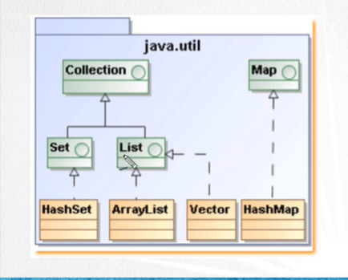

### API de Colecciones

<table align="center" >
  <tr>
    <td align="center" style="padding=0;width=50%;">
      
    </td>
  </tr>
</table>

---

<table align="center">
  <tr>
    <td colspan="2" align="center">Collections</td>
    <td colspan="2" align="center">Map</td>
  </tr>

  <tr>
    <td>Set</td>
    <td>Lis</td>
     td>⬆️</td>
  </tr>

  <tr>
    <td>⬆️</td>
    <td>⬆️</td>
    <td>⬆️</td>
  </tr>

  <tr>
    <td><strong>HashSet</strong></td>
    <td><strong>ArrayList</strong></td>
    <td><strong>HashMap</strong></td>
  </tr>
</table>

