<h2 align="center"> Control Clientes - Proyecto Servlet y JSP</h2>

**Descargar Conector Java**

📦 Descargar [Connector/J](https://dev.mysql.com/downloads/connector/j/?os=26) Conecctor para Glashfish.

<table align="center" >
  <tr>
    <td align="center" style="padding=0;width=50%;">
      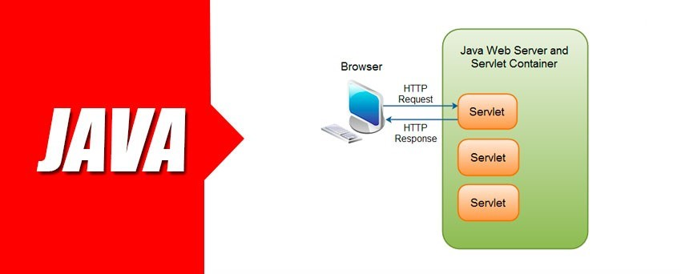
    </td>
  </tr>
</table>

_JDBC URL_

```java
jdbc:mysql://localhost:3306/mysql?zeroDateTimeBehavior=CONVERT_TO_NULL&useTimezone=true&serverTimezon=UTC
```

_Configuracion Manual de Driver_

```java
com.mysql.cj.jdbc.Driver
MySQL (Connector/J driver)
```


_Instalacion y Prueba de Conector_

<table align="center" >
  <tr>
    <td align="center" style="padding=0;width=50%;">
      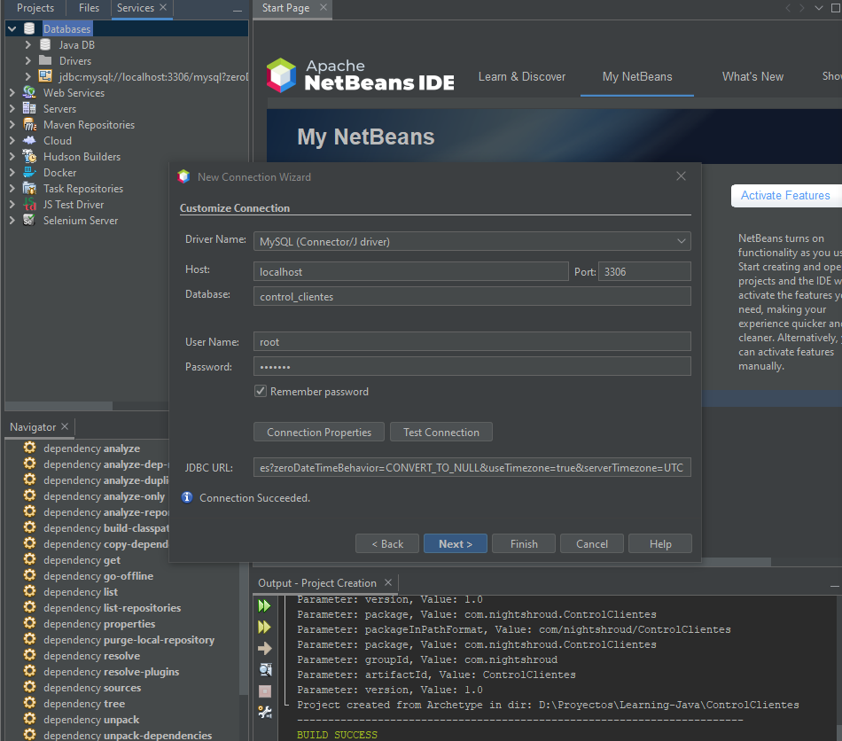
    </td>
  </tr>
</table>

<table align="center" >
  <tr>
    <td align="center" style="padding=0;width=50%;">
      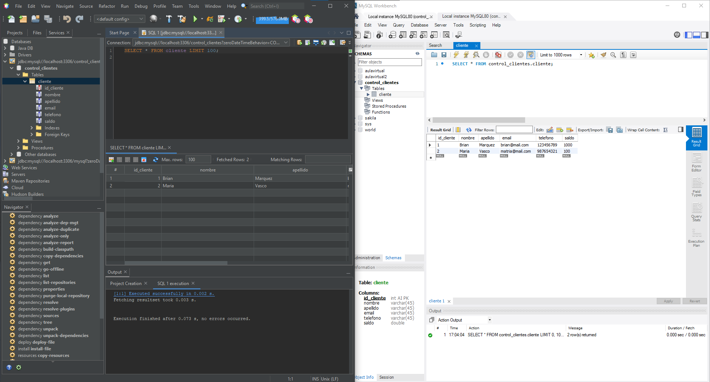
    </td>
  </tr>
</table>

### Instalar Modelador BPMN

<table align="center" >
  <tr>
    <td align="center" style="padding=0;width=50%;">
      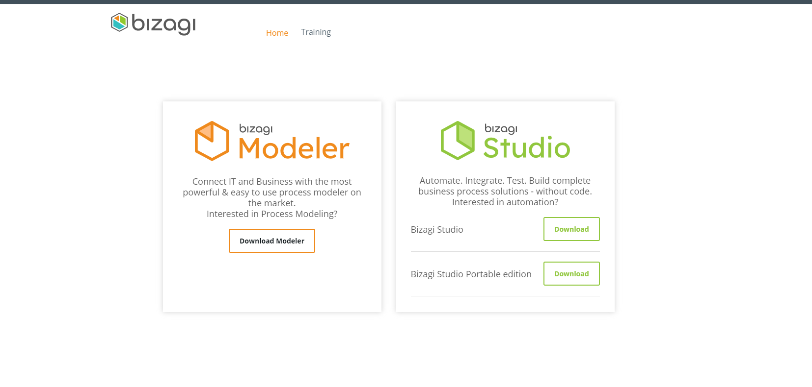
    </td>
  </tr>
</table>


_Usaremos la herramienta BIzagui Modeler_

📦 Descargar [Bizagui Modeler](https://portal.bizagi.com/en/bizagi-modeler-download) Software de mapeo de procesos de negocio gratuito, intuitivo y colaborativo utilizado por millones de personas en todo el mundo.<br>

📦 Software Online Visual [Online Visual](https://online.visual-paradigm.com/diagrams/features/bpmn-tool/) Herramienta de diagrama de BPMN en línea.<br>

### Diagrama

<table align="center" >
  <tr>
    <td align="center" style="padding=0;width=50%;">
      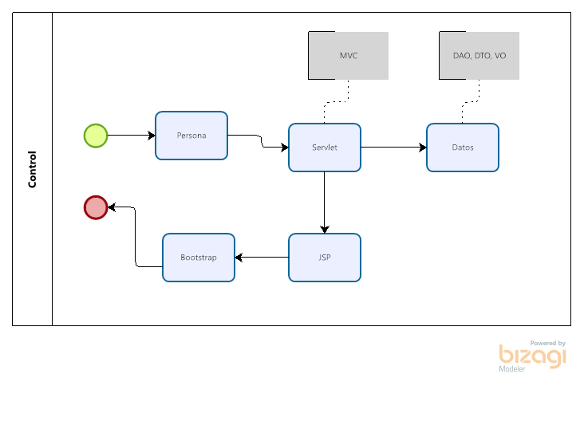
    </td>
  </tr>
</table>

### Agregar Liberias al proyecto

```java
        <dependency>
            <groupId>mysql</groupId>
            <artifactId>mysql-connector-java</artifactId>
            <version>8.0.25</version>
        </dependency>
        <dependency>
            <groupId>org.apache.commons</groupId>
            <artifactId>commons-dbcp2</artifactId>
            <version>2.8.0</version>
        </dependency>
```
## Conexion a la Base de Datos MYSQL

_Datos_
_Clase Conexion_

```java
public class Conexion {
    
    private static final String JDBC_URL = "jdbc:mysql://localhost:3306/control_clientes?useSSL=false&useTimezone=true&serverTimezone=UTC&allowPublicKeyRetrieval=true";
    private static final String JDBC_USER = "root";
    private static final String JDBC_PASSWORD = "briandb";

   public static BasicDataSource getDataSource(){
        BasicDataSource ds = new BasicDataSource();
        ds.setUrl(JDBC_URL);
        ds.setUsername(JDBC_USER);
        ds.setPassword(JDBC_PASSWORD);
        ds.setInitialSize(50); // 50 conecciones
        return ds;
    }
    
    public static Connection getConnection() throws SQLException{
        return getDataSource().getConnection();
    }
    
    public static void close(ResultSet rs){
        try {
            rs.close();
        } catch (SQLException ex) {
           ex.printStackTrace(System.out);
        }
    }
    
    public static void close(PreparedStatement stmt){
        try {
            stmt.close();
        } catch (SQLException ex) {
            ex.printStackTrace(System.out);
        }
    }
    
    public static void close(Connection conn){
        try {
            conn.close();
        } catch (SQLException ex) {
            ex.printStackTrace(System.out);
        }
    }
```

### Mapeo

_Entidad Cliente_

```java
public class Cliente {
    
    private int idCliente;
    private String nombre;
    private String apellido;
    private String email;
    private String telefono;
    private double saldo;

    public Cliente() {
    }

    public Cliente(int idCliente) {
        this.idCliente = idCliente;
    }

    public Cliente(String nombre, String apellido, String email, String telefono, double saldo) {
        this.nombre = nombre;
        this.apellido = apellido;
        this.email = email;
        this.telefono = telefono;
        this.saldo = saldo;
    }

    public Cliente(int idCliente, String nombre, String apellido, String email, String telefono, double saldo) {
        this.idCliente = idCliente;
        this.nombre = nombre;
        this.apellido = apellido;
        this.email = email;
        this.telefono = telefono;
        this.saldo = saldo;
    }

    public int getIdCliente() {
        return idCliente;
    }

    public void setIdCliente(int idCliente) {
        this.idCliente = idCliente;
    }

    public String getNombre() {
        return nombre;
    }

    public void setNombre(String nombre) {
        this.nombre = nombre;
    }

    public String getApellido() {
        return apellido;
    }

    public void setApellido(String apellido) {
        this.apellido = apellido;
    }

    public String getEmail() {
        return email;
    }

    public void setEmail(String email) {
        this.email = email;
    }

    public String getTelefono() {
        return telefono;
    }

    public void setTelefono(String telefono) {
        this.telefono = telefono;
    }

    public double getSaldo() {
        return saldo;
    }

    public void setSaldo(double saldo) {
        this.saldo = saldo;
    }

    @Override
    public String toString() {
        return "Cliente{" + "idCliente=" + idCliente + ", nombre=" + nombre + ", apellido=" + apellido + ", email=" + email + ", telefono=" + telefono + ", saldo=" + saldo + '}';
    }
```

### Creacion de Clase Dao

- Uso del patron de diseño DAO (Objeto de acceso a datos)

En software de computadores, un objeto de acceso a datos (en inglés, data access object, abreviado DAO) es un componente de software que suministra una interfaz común entre la aplicación y uno o más dispositivos de almacenamiento de datos, tales como una Base de datos o un archivo. El término se aplica frecuentemente al Patrón de diseño Object.

**vENTAJAS**

Los Objetos de Acceso a Datos son un Patrón de los subordinados de Diseño Core J2EE y considerados una buena práctica. La ventaja de usar objetos de acceso a datos es que cualquier objeto de negocio (aquel que contiene detalles específicos de operación o aplicación) no requiere conocimiento directo del destino final de la información que manipula.

Los Objetos de Acceso a Datos pueden usarse en Java para aislar a una aplicación de la tecnología de persistencia Java subyacente (API de Persistencia Java), la cual podría ser JDBC, JDO, Enterprise JavaBeans, TopLink, EclipseLink, Hibernate, iBATIS, o cualquier otra tecnología de persistencia. Usar Objetos de Acceso de Datos significa que la tecnología subyacente puede ser actualizada o cambiada sin cambiar otras partes de la aplicación.

**Desventajas**

La flexibilidad tiene un precio. Cuando se añaden DAOs a una aplicación, la complejidad adicional de usar otra capa de persistencia incrementa la cantidad de código ejecutado durante tiempo de ejecución. La configuración de las capas de persistencia requiere en la mayoría de los casos mucho trabajo.

Las aplicaciones críticas con el rendimiento no deberían usar DAOs.
[WIKIPEDIA](https://es.wikipedia.org/wiki/Objeto_de_acceso_a_datos)


```java
public List<Cliente> listar() {
        Connection conn = null;
        PreparedStatement stmt = null;
        ResultSet rs = null;
        Cliente cliente = null;
        List<Cliente> clientes = new ArrayList<>();
        try {
            conn = Conexion.getConnection();
            stmt = conn.prepareStatement(SQL_SELECT);
            rs = stmt.executeQuery();
            while (rs.next()) {
                int idCliente = rs.getInt("id_cliente");
                String nombre = rs.getString("nombre");
                String apellido = rs.getString("apellido");
                String email = rs.getString("email");
                String telefono = rs.getString("telefono");
                double saldo = rs.getDouble("saldo");

                cliente = new Cliente(idCliente, nombre, apellido, email, telefono, saldo);
                clientes.add(cliente);
            }
        } catch (SQLException ex) {
            ex.printStackTrace(System.out);
        } finally {
            Conexion.close(rs);
            Conexion.close(stmt);
            Conexion.close(conn);
        }
        return clientes;
    }   
    
    public Cliente encontrar(Cliente cliente) {
        Connection conn = null;
        PreparedStatement stmt = null;
        ResultSet rs = null;
        try {
            conn = Conexion.getConnection();
            stmt = conn.prepareStatement(SQL_SELECT_BY_ID);
            stmt.setInt(1, cliente.getIdCliente());
            rs = stmt.executeQuery();
            rs.absolute(1);//nos posicionamos en el primer registro devuelto

            String nombre = rs.getString("nombre");
            String apellido = rs.getString("apellido");
            String email = rs.getString("email");
            String telefono = rs.getString("telefono");
            double saldo = rs.getDouble("saldo");

            cliente.setNombre(nombre);
            cliente.setApellido(apellido);
            cliente.setEmail(email);
            cliente.setTelefono(telefono);
            cliente.setSaldo(saldo);

        } catch (SQLException ex) {
            ex.printStackTrace(System.out);
        } finally {
            Conexion.close(rs);
            Conexion.close(stmt);
            Conexion.close(conn);
        }
        return cliente;
    }

    public int insertar(Cliente cliente) {
        Connection conn = null;
        PreparedStatement stmt = null;
        int rows = 0;
        try {
            conn = Conexion.getConnection();
            stmt = conn.prepareStatement(SQL_INSERT);
            stmt.setString(1, cliente.getNombre());
            stmt.setString(2, cliente.getApellido());
            stmt.setString(3, cliente.getEmail());
            stmt.setString(4, cliente.getTelefono());
            stmt.setDouble(5, cliente.getSaldo());

            rows = stmt.executeUpdate();
        } catch (SQLException ex) {
            ex.printStackTrace(System.out);
        } finally {
            Conexion.close(stmt);
            Conexion.close(conn);
        }
        return rows;
    }

    public int actualizar(Cliente cliente) {
        Connection conn = null;
        PreparedStatement stmt = null;
        int rows = 0;
        try {
            conn = Conexion.getConnection();
            stmt = conn.prepareStatement(SQL_UPDATE);
            stmt.setString(1, cliente.getNombre());
            stmt.setString(2, cliente.getApellido());
            stmt.setString(3, cliente.getEmail());
            stmt.setString(4, cliente.getTelefono());
            stmt.setDouble(5, cliente.getSaldo());
            stmt.setInt(6, cliente.getIdCliente());

            rows = stmt.executeUpdate();
        } catch (SQLException ex) {
            ex.printStackTrace(System.out);
        } finally {
            Conexion.close(stmt);
            Conexion.close(conn);
        }
        return rows;
    }

    public int eliminar(Cliente cliente) {
        Connection conn = null;
        PreparedStatement stmt = null;
        int rows = 0;
        try {
            conn = Conexion.getConnection();
            stmt = conn.prepareStatement(SQL_DELETE);
            stmt.setInt(1, cliente.getIdCliente());

            rows = stmt.executeUpdate();
        } catch (SQLException ex) {
            ex.printStackTrace(System.out);
        } finally {
            Conexion.close(stmt);
            Conexion.close(conn);
        }
        return rows;
    }
```

## Backend

- Se observa el Backend terminado.

<table align="center" >
  <tr>
    <td align="center" style="padding=0;width=50%;">
      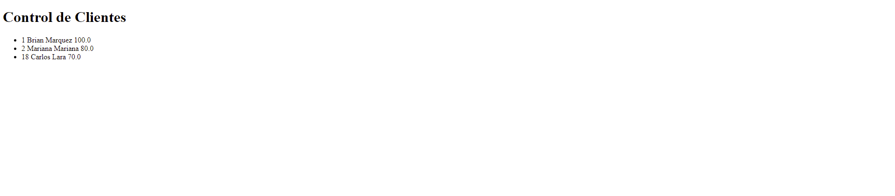
    </td>
  </tr>
</table>

## Bootstrap

Link [Bootstrap](https://getbootstrap.com/docs/5.0/getting-started/introduction/)

Link [Colores Bootstrap](https://getbootstrap.com/docs/4.0/utilities/colors/)

Uso de bootstrap para: 

- Para agregar estilos facilmente
- Adaptacion en Pantalla

<table align="center" >
  <tr>
    <td align="center" style="padding=0;width=50%;">
      
    </td>
  </tr>
</table>

## Iconos

Se Agregaran Iconos para que sea mas interactivo con el usuario

Link [Font Awesome](https://fontawesome.com/start)

<table align="center" >
  <tr>
    <td align="center" style="padding=0;width=50%;">
      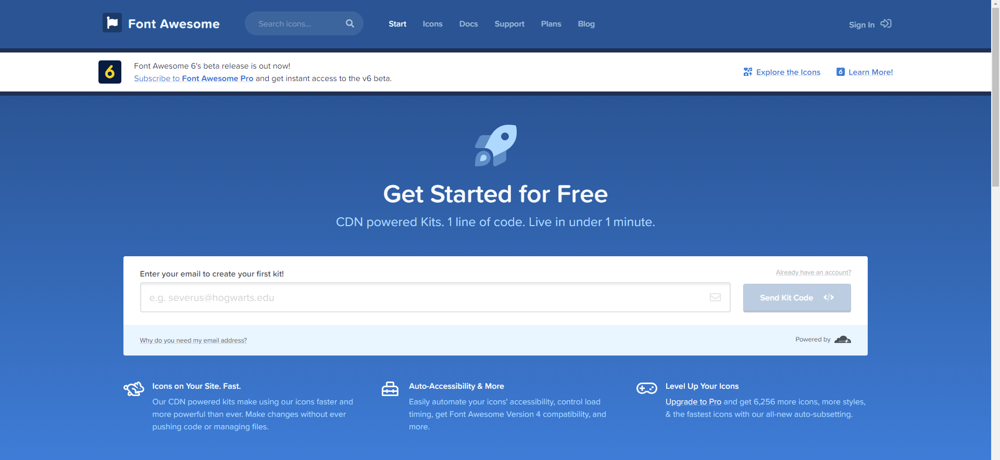
    </td>
  </tr>
</table>

**Cabeceros - Pie de Pagina**

_Visualizacion de Backend_

```java
<ul>
    <c:forEach var="cliente" items="${clientes}">
        <li>${cliente.idCliente} ${cliente.nombre} ${cliente.apellido} ${cliente.saldo}</li>
        </c:forEach>
</ul>
```


<table align="center" >
  <tr>
    <td align="center" style="padding=0;width=50%;">
      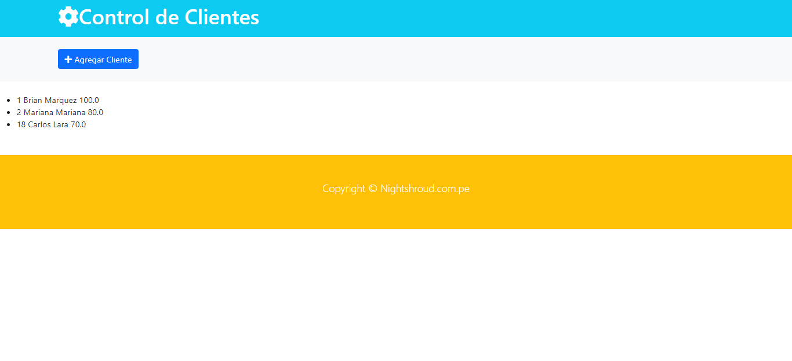
    </td>
  </tr>
</table>

## Listado de Clientes - Basico

- Se Observa el listado de clientes , ,usando modulos deparados 

<table align="center" >
  <tr>
    <td align="center" style="padding=0;width=50%;">
      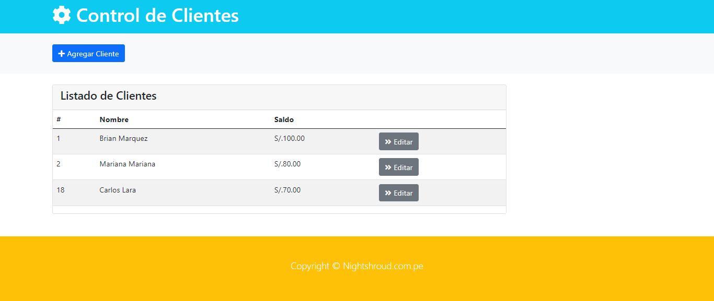
    </td>
  </tr>
</table>


## Listado Cliente - Completo

- Se Agregaron las tarjetas en el lado derecho, teniendo en cuenta el GRID de Botstrap.

<table align="center" >
  <tr>
    <td align="center" style="padding=0;width=50%;">
      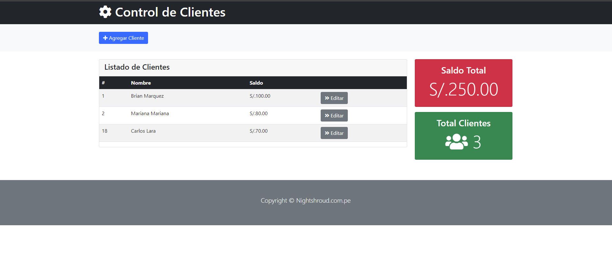
    </td>
  </tr>
</table>

## Ventanas Moldal - Agregar Cliente

- Ventana modal de Agregar cliente con Valudaciones en Bootstrap

<table align="center" >
  <tr>
    <td align="center" style="padding=0;width=50%;">
      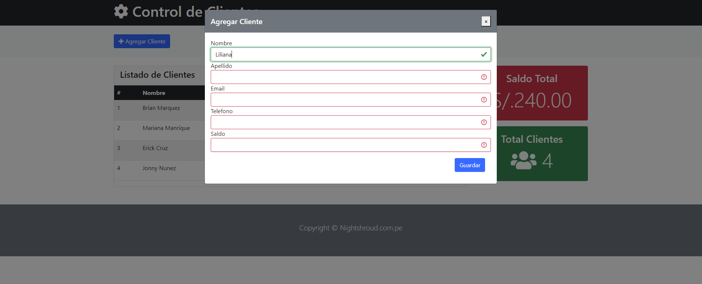
    </td>
  </tr>
</table>

## Siderbar

-Iconos para el Siderar

[Material Desing Icon](https://materialdesignicons.com/icon/home-outline)


<table align="center" >
  <tr>
    <td align="center" style="padding=0;width=50%;">
      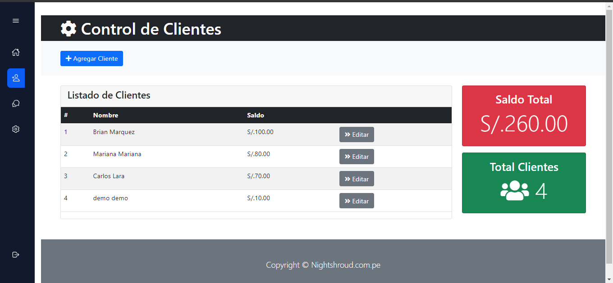
    </td>
  </tr>
</table>


## Terminado

- Aplicativo terminado y funcionando

<table align="center" >
  <tr>
    <td align="center" style="padding=0;width=50%;">
      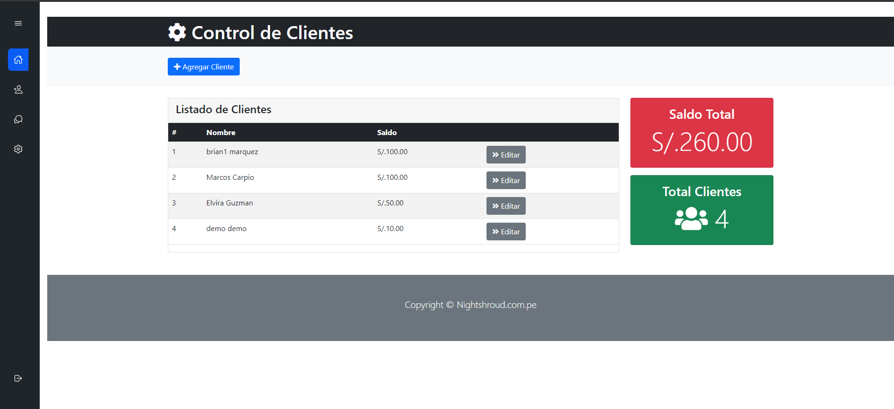
    </td>
  </tr>
</table>
