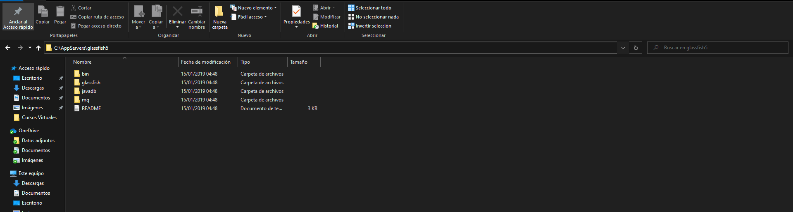
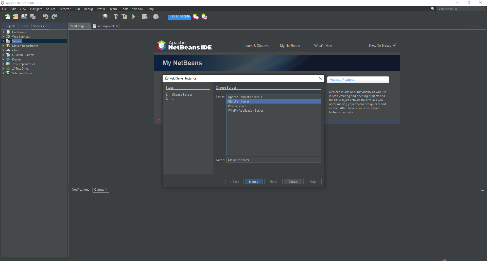
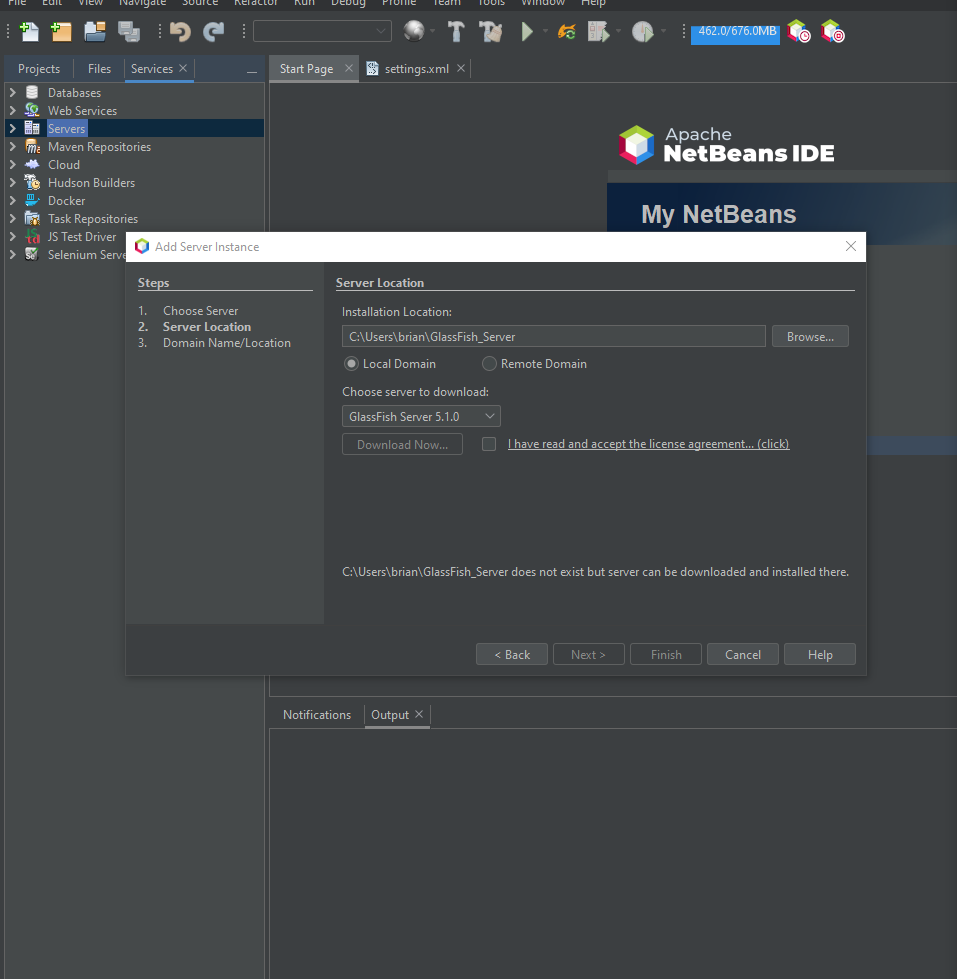
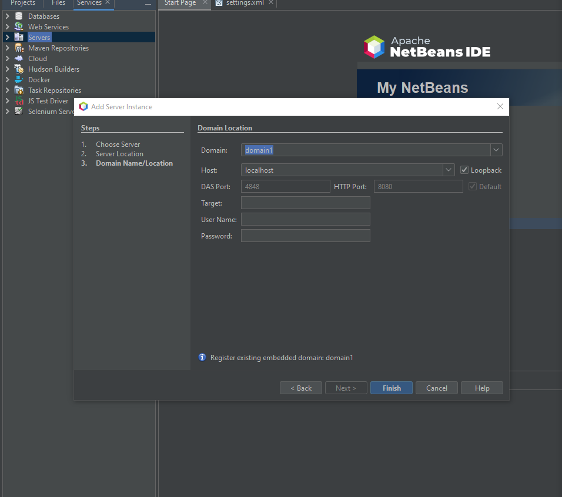
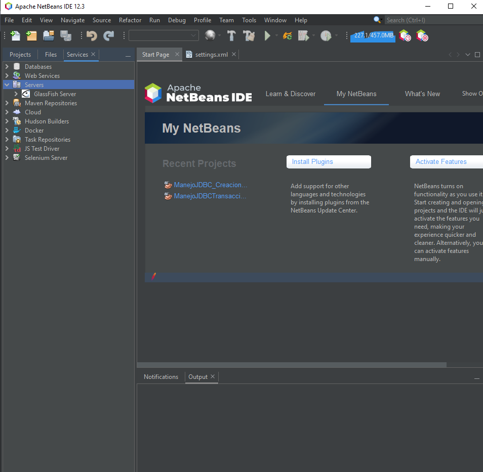

### Descargar Glashfish y JDK

📦 Link GlashFish [Descargar Glashfish ](https://javaee.github.io/glassfish/download)

- Crear un Carteta en el disco C con el nomnre "AppServers" y descomprimir el archivo descargado dentro de ella

<table align="center" >
  <tr>
    <td align="center" style="padding=0;width=50%;">
      
    </td>
  </tr>
</table>

### Instalacion

<table align="center" >
  <tr>
    <td align="center" style="padding=0;width=50%;">
      
    </td>
  </tr>
</table>

_Next_

<table align="center" >
  <tr>
    <td align="center" style="padding=0;width=50%;">
      
    </td>
  </tr>
</table>

_Aceptar_

<table align="center" >
  <tr>
    <td align="center" style="padding=0;width=50%;">
      
    </td>
  </tr>
</table>

_Servidor Instalaldo_

<table align="center" >
  <tr>
    <td align="center" style="padding=0;width=50%;">
      
    </td>
  </tr>
</table>

## INSTALAR JDK

📦 Link JDK 8 [Descargar JDK ](https://www.oracle.com/java/technologies/javase/javase-jdk8-downloads.html)

