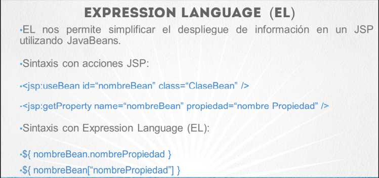
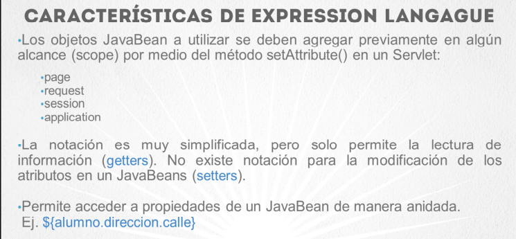

### Expression Languaje

Nos Permite simplificar el despliegue de infirmacion en un JSP utilizanbdo JavaBeans

<table align="center" >
  <tr>
    <td align="center" style="padding=0;width=50%;">
      
    </td>
  </tr>
</table>

### Caracteristicas 

<table align="center" >
  <tr>
    <td align="center" style="padding=0;width=50%;">
      
    </td>
  </tr>
</table>

### Mas caracteristicas de Expression Languaje

- Acceso a propiedades de un Objeto de tipo Colletion o Arreglo
-  Ej. ```java${listaPersonas[indice/llave]}```