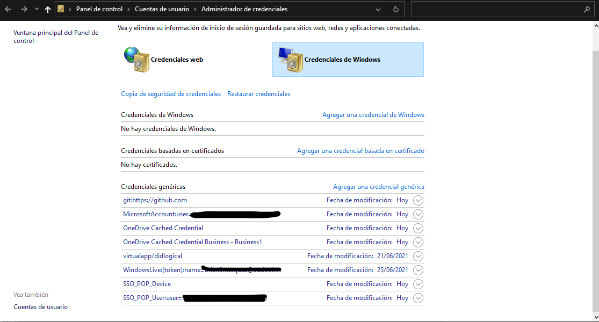

### Cambiar Cuenta de GIT/Editar

**Para cambiatr de cuenta**

- Borrar Credenciales

<table align="center" >
  <tr>
    <td align="center" style="padding=0;width=50%;">
      
    </td>
  </tr>
</table>

* luego de borrar Ingresar nuevamente

**Realizar cambios en la Configuracion de Git**

* En su terminal, navegue hasta el repositorio en el que desea realizar los cambios. 

* Ejecute git config --list para verificar el nombre de usuario y el correo electrónico actuales en su repositorio local.

```bash
config --list
```

* Cambiar el nombre de usuario y correo electrónico como se desee. Haz que sea un cambio global o específico para el repositorio local:

```bash
git config --global user.email "you@example.com"
git config --global user.name "Your Name"
```

Para establecer la identidad solo en el repositorio actual, elimine --global y ejecute los siguientes comandos en su directorio Proyecto/Repo

```bash
git config user.email "you@example.com"
git config user.name "Your Name"
```


Fuente: [it-swarm-es.com](https://www.it-swarm-es.com/es/git/como-cambiar-mi-nombre-de-usuario-git-en-la-terminal/1046566054/)