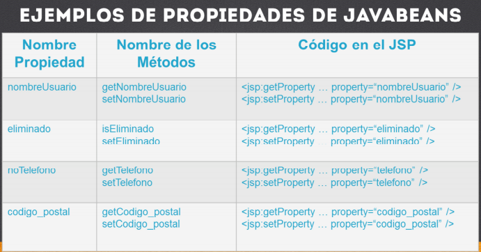
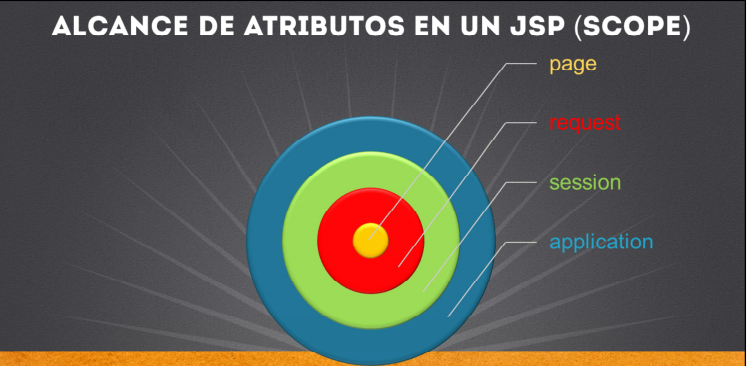

### Manejo de Javabeans con JSPS

- Los JSPS puede acceder alos JavaBeans
- Un javaBean es na clase de java que sigue ciertas reglas basicas:
    * Debe teerun constructor vacio
    * Todos los atributos debe ser privados
    * Se debe generar el metodo get y ser para cadaatributo

- Un JSP debe utulizar el nombre de la propiedad para acceder o modificar el atributo de un JavaBean

- Indirectamente el JSP manda llamar al metodo get o set asociado con la propiedad indicada en el JSP

 **Ejemplos de Propiedades de Javabeans**

<table align="center" >
  <tr>
    <td align="center" style="padding=0;width=50%;">
      
    </td>
  </tr>
</table>

### Alcance de atributos en un JSP (SCOPE)

<table align="center" >
  <tr>
    <td align="center" style="padding=0;width=50%;">
      
    </td>
  </tr>
</table>

