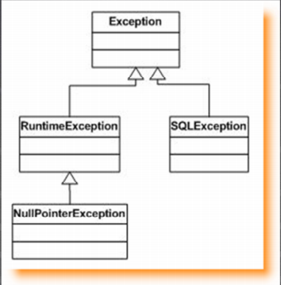
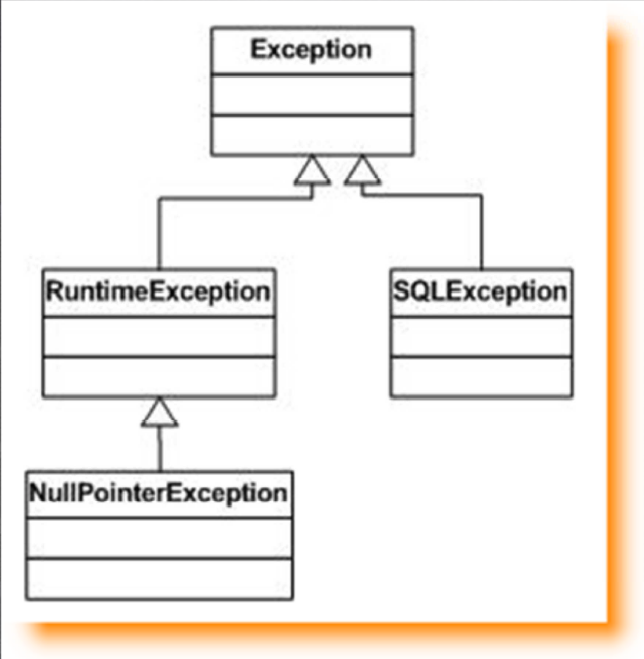

<<<<<<< HEAD
### Excepciones II

<table align="center" >
  <tr>
    <td align="center" style="padding=0;width=50%;">
      
    </td>
  </tr>
</table>
=======
### Manejo de Excepciones II

<table align="center" >
  
Velocidad

  <tr>
    <td align="center" style="padding=0;width=50%;">
      
    </td>
  </tr>
</table>

> RuntimeException: Error en tiempo de Ejecucion  
> RuntimeException: Error en tiempo de Ejecucion  
>>>>>>> 7b709032fef2fd01f5829b41007a9b007814cd69
