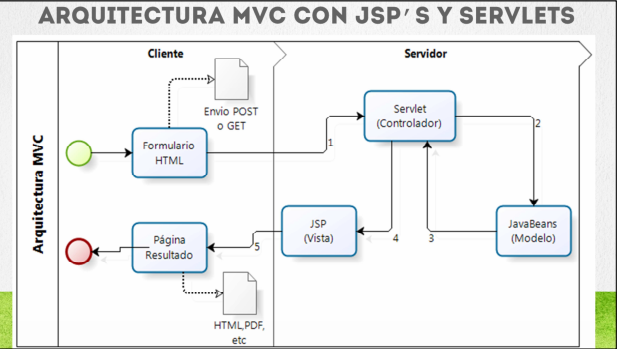

### Patron de Diseño MVC

- Los Servlets esta enfocados en controlar el flujo de la peticion HTTP

- Los JSPS estan enfocados en desplegar la informacion de la aplicacion web

- La Informacionqeu se comparte entrer lo componente (Sevlets y JSPS) suele manejarse con JavaBeans

- `El patron de Diseño MVC (Modelo Vista Controlador) Nos permite integrar a los JSP`S(vista) , a los servlets (controlador) y los javaBeans (Modelo)`

### Frameworks que utilizan el patron MVC

`JSP/Servlets` : se implmenta manualmente con ayuda del objeo RequestDispatcher para controlar el flujo de la aplicacion.

`Struts`: 
 Es un framework de Apache , el cual utiliza JSP'( vista con tags de Struts, ActonForm(Modelo), Action (Controlador), entrer otros companentes.

JavaServerFaces(JSF): Es una tecnologias que utiliza conceptos como JSP's(VIST) con tags de JSF, managedBean(Controlador) y JavaBeans (Modelo)

SpringMVC : Es un extrernsion del framework de Spring, que utiliza JSP(vista) con tags de Spring, clases Java (Controladores) y JavaBeans (Modelo)

**Arquitectura MVC con JSP`s y Servlets**

<table align="center" >
  <tr>
    <td align="center" style="padding=0;width=50%;">
      
    </td>
  </tr>
</table>

**Pasos Generales de un servlet controlador**

a) Procesamos y validamos lo parametros (si aplica)
b) Realizamos la logica de presentacion almacenamos el resultado en JavaBeans
c) Compartimos l objeto bean a utiliazr en algun alcance (scape)

Numeration  | File   |  Link       |    Folk     |  Code       | Version     | State       | Download    |  Go back    |
|:----------:|:------:|:-----------:|:-----------:|:-----------:|:-----------:|:-----------:|:-----------:|:-----------:|
|F40        | [Ejercicio Patron de Diseño MVC]()  |   | ✔️ | yes | yes | ✔️ | 💾 | [⬅️Atras](#https://github.com/BrianMarquez3/Learning-Java) |

