<h2 align="center">  Java   | POO, JDBC, Servlets, JavaEE, Web Services, JSF, EJB, JPA, PrimeFaces, Hibernate, Spring, Struts </h2>
<!-- https://shields.io/ -->

<p align="center">
  
   </a>
    
  </a>
  <a href="https://github.com/BrianMarquez3/Learnig-Java/stargazers">
    
  </a>
  <a href="https://github.com/BrianMarquez3/Learnig-Java/network">
    
  </a>
    
  </a>
  
  </a>
    
  </a>
  
  </a>
    
  </a>
  
   </a>
   <a href="https://github.com/BrianMarquez3/Learnig-Java/network">
    
  </a><br>
 
  
  
</P>


<table align="center" >
  <tr>
    <td align="center" style="padding=0;width=50%;">
      
    </td>
  </tr>
</table>

  <!--  -->

📦 [Install Gitpot](https://www.gitpod.io/) Describe your dev environments as code and automate the last missing piece in your DevOps pipeline.

## Tabla de contenidos

| Numeration   | Check  |    Topic      |   Quantization   |    Edit Gitpot    |    Downloads    |  link  |
| ------------ |--------|-------------- |----------------- |------------------ |---------------- |-------- |
|  A  |:heavy_check_mark: | [Que es java](#Que-es-java)   |      | ☕ | 💾 | [ ⬅️ Atras](https://github.com/BrianMarquez3) | 
|  B   |:heavy_check_mark: | [James Gosling](#James-Gosling)   |  | ☕ | 💾 |  [ ⬅️ Atras](https://github.com/BrianMarquez3) | 
|  C   |:heavy_check_mark: | [Instalacion](#instalacion)  |      | ☕  | 💾 |  [ ⬅️ Atras](https://github.com/BrianMarquez3) | 
|  001   |:heavy_check_mark: | [Hola Mundo](#Hola-Mundo)  |       | ☕  | 💾 |  [ ⬅️ Atras](https://github.com/BrianMarquez3) |  
|  002   |:heavy_check_mark: | [Concatenacion](#Concatenacion)   |    | ☕ | 💾 | [ ⬅️ Atras](https://github.com/BrianMarquez3) | 
|  003   |:heavy_check_mark: | [Scanner](#Scanner)   |    | ☕ | 💾 | [ ⬅️ Atras](https://github.com/BrianMarquez3) | 
|  004   |:heavy_check_mark: | [Tipos Primitivos](#Tipos-Primitivos)   |      | ☕ | 💾 | [ ⬅️ Atras](https://github.com/BrianMarquez3) | 
|  005   |:heavy_check_mark: | [Variables](#variables)  |     | [](https://gitpod.io/#https://github.com/BrianMarquez3/Learning-Java/tree/main/variables) | [](https://github.com/BrianMarquez3/Learning-Java/tree/main/variables)  |  [ ⬅️ Atras](https://github.com/BrianMarquez3) |  
|  006   |:heavy_check_mark: | [Variables-II](#Variables-II)  |        | [](https://gitpod.io/#https://github.com/BrianMarquez3/Learning-Java/tree/main/variables_II_Datos_Envoltorio) | [](https://github.com/BrianMarquez3/Learning-Java/tree/main/variables_II_Datos_Envoltorio)  |  [ ⬅️ Atras](https://github.com/BrianMarquez3) |  
|  007   |:heavy_check_mark: | [Constantes](#Constantes)  |       | [](https://gitpod.io/#https://github.com/BrianMarquez3/Learning-Java/tree/main/constantes) | [](https://github.com/BrianMarquez3/Learning-Java/tree/main/constantes)  |  [ ⬅️ Atras](https://github.com/BrianMarquez3) | 
|  008   |:heavy_check_mark: | [Ingresar Datos Consola](#Ingresar-Datos-Consola)  |       |  [](https://gitpod.io/#https://github.com/BrianMarquez3/Learning-Java/tree/main/IngresarDatosConsola) | [](https://github.com/BrianMarquez3/Learning-Java/tree/main/IngresarDatosConsola)  |  [ ⬅️ Atras](https://github.com/BrianMarquez3) | 
|  009   |:heavy_check_mark: | [Ingresar Dato ViaShow InputDialog](#Ingresar-Dato-ViaShow-InputDialog)  |      | [](https://gitpod.io/#https://github.com/BrianMarquez3/Learning-Java/tree/main/IngresarDatosViaShowInputDialog) | [](https://github.com/BrianMarquez3/Learning-Java/tree/main/IngresarDatosViaShowInputDialog)  |  [ ⬅️ Atras](https://github.com/BrianMarquez3) | 
|  010   |:heavy_check_mark: | [Operadores Matematicos](#Operadores-Matematicos)  |        | [](https://gitpod.io/#https://github.com/BrianMarquez3/Learning-Java/tree/main/operadoresMatematicos) | [](https://github.com/BrianMarquez3/Learning-Java/tree/main/operadoresMatematicos)  |  [ ⬅️ Atras](https://github.com/BrianMarquez3) | 
|  011   |:heavy_check_mark: | [Operadores Matematicos Cortos](#operadores-Matematicos-Cortos)  |       | [](https://gitpod.io/#https://github.com/BrianMarquez3/Learning-Java/tree/main/operadoresMatematicosCortos) | [](https://github.com/BrianMarquez3/Learning-Java/tree/main/operadoresMatematicosCortos)  |   [ ⬅️ Atras](https://github.com/BrianMarquez3) | 
|  012   |:heavy_check_mark: | [Operador Incremental Decremental](#Operador-Incremental-Decremental)  |          |[](https://gitpod.io/#https://github.com/BrianMarquez3/Learning-Java/tree/main/operadorIncrementalDecremental) | [](https://github.com/BrianMarquez3/Learning-Java/tree/main/operadorIncrementalDecremental)  |  [ ⬅️ Atras](https://github.com/BrianMarquez3) |
|  013   |:heavy_check_mark: | [Operaciones Matematicas Math](#Operaciones-Matematicas-Math)  |        | [](https://gitpod.io/#https://github.com/BrianMarquez3/Learning-Java/tree/main/operacionesMatematicasMath) | [](https://github.com/BrianMarquez3/Learning-Java/tree/main/operacionesMatematicasMath)  |  [ ⬅️ Atras](https://github.com/BrianMarquez3) |
|  014   |:heavy_check_mark: | [Calcular volumen de un cilindro](#Calcular-volumen-de-un-cilindro) |      | [](https://gitpod.io/#https://github.com/BrianMarquez3/Learning-Java/tree/main/calcularvolumendeuncilindro) | [](https://github.com/BrianMarquez3/Learning-Java/tree/main/calcularvolumendeuncilindro) | ⬅️[Atras](https://github.com/BrianMarquez3) | 
|  015   |:heavy_check_mark: | [Manejo de Fechas](#Manejo-de-Fechas)  |       | [](https://gitpod.io/#https://github.com/BrianMarquez3/Learning-Java/tree/main/fechas) | [](https://github.com/BrianMarquez3/Learning-Java/tree/main/fechas) |  [ ⬅️ Atras](https://github.com/BrianMarquez3) |
|  016   |:heavy_check_mark: | [Condicionales](#Condicionales)  |      | [](https://gitpod.io/#https://github.com/BrianMarquez3/Learning-Java/tree/main/condicionales) | [](https://github.com/BrianMarquez3/Learning-Java/tree/main/condicionales) | [ ⬅️ Atras](https://github.com/BrianMarquez3) |
|  017   |:heavy_check_mark: | [Condicionales II](#Condicionales)  |       | [](https://gitpod.io/#https://github.com/BrianMarquez3/Learning-Java/tree/main/condicionales_II_switch_case) | [](https://github.com/BrianMarquez3/Learning-Java/tree/main/condicionales_II_switch_case) |  [ ⬅️ Atras](https://github.com/BrianMarquez3) |
|  019   |:heavy_check_mark: | [Condicionales III](#Condicionales-III)  |       | [](https://gitpod.io/#https://github.com/BrianMarquez3/Learning-Java/tree/main/condicionales_III_String) | [](https://github.com/BrianMarquez3/Learning-Java/tree/main/condicionales_III_String) |  [ ⬅️ Atras](https://github.com/BrianMarquez3) |
|  020   |:heavy_check_mark: | [Adivinar-numero-random](#adivinar-numero-random)  |       | [](https://gitpod.io/#https://github.com/BrianMarquez3/Learning-Java/tree/main/adivinar_numero_random) | [](https://github.com/BrianMarquez3/Learning-Java/tree/main/adivinar_numero_random) |  [ ⬅️ Atras](https://github.com/BrianMarquez3) | 
|  021   |:heavy_check_mark: | [Ciclo While](#Ciclo-While)  |       | [](https://github.com/BrianMarquez3/Learning-Java/tree/main/holaMundo) | [](https://github.com/BrianMarquez3/Learning-Java/tree/main/ciclo_While) |  [ ⬅️ Atras](https://github.com/BrianMarquez3) |
|  022   |:heavy_check_mark: | [Ciclo Do While](#Ciclo-Do-While)  |       |[](https://gitpod.io/#https://github.com/BrianMarquez3/Learning-Java/tree/main/ciclo_doWhile) | [](https://github.com/BrianMarquez3/Learning-Java/tree/main/ciclo_doWhile) |  [ ⬅️ Atras](https://github.com/BrianMarquez3) | 
|  023   |:heavy_check_mark: | [Ciclo For](#Ciclo-For)  |        | [](https://github.com/BrianMarquez3/Learning-Java/tree/main/holaMundo) | [](https://gitpod.io/#https://github.com/BrianMarquez3/Learning-Java/tree/main/ciclo_For) |  [ ⬅️ Atras](https://github.com/BrianMarquez3) |
|  024   |:heavy_check_mark: | [Ciclo foreach](#fCiclo-foreach)  |       | [](https://gitpod.io/#https://github.com/BrianMarquez3/Learning-Java/tree/main/ciclo_foreach) | [](https://github.com/BrianMarquez3/Learning-Java/tree/main/ciclo_foreach) |  [ ⬅️ Atras](https://github.com/BrianMarquez3) | 
|  025   |:heavy_check_mark: | [Escalera con For](#Escalera-con-For)  |        | [](https://gitpod.io/#https://github.com/BrianMarquez3/Learning-Java/tree/main/escalera_conFor) | [](https://github.com/BrianMarquez3/Learning-Java/tree/main/escalera_conFor) |  [ ⬅️ Atras](https://github.com/BrianMarquez3) |
|  026   |:heavy_check_mark: | [Arreglos](#Arreglos)  |      | [](https://gitpod.io/#https://github.com/BrianMarquez3/Learning-Java/tree/main/arreglos) | [](https://github.com/BrianMarquez3/Learning-Java/tree/main/arreglos) |  [ ⬅️ Atras](https://github.com/BrianMarquez3) |
|  027   |:heavy_check_mark: | [Mezclar 2 Arreglos](#Mezclar-2-Arreglos)  |       | [](https://gitpod.io/#https://github.com/BrianMarquez3/Learning-Java/tree/main/mezclar2Arreglos) | [](https://github.com/BrianMarquez3/Learning-Java/tree/main/mezclar2Arreglos) |  [ ⬅️ Atras](https://github.com/BrianMarquez3) |
|  028   |:heavy_check_mark: | [Palindromos](#Palindromos)  |      | [](https://gitpod.io/#https://github.com/BrianMarquez3/Learning-Java/tree/main/palidromos) | [](https://github.com/BrianMarquez3/Learning-Java/tree/main/palidromos) |  [ ⬅️ Atras](https://github.com/BrianMarquez3) |
|  030   |:heavy_check_mark: | [Ordenamientos Metodo de la Burbuja](#Ordenamientos-Metodo-de-la-Burbuja)  |        | [](https://gitpod.io/#https://github.com/BrianMarquez3/Learning-Java/tree/main/ordenamiento_burbuja) | [](https://github.com/BrianMarquez3/Learning-Java/tree/main/ordenamiento_burbuja) |  [ ⬅️ Atras](https://github.com/BrianMarquez3) |
|  031   |:heavy_check_mark: | [Ordenamientos Metodo de la Burbuja Mejorado](#Ordenamientos-Metodo-de-la-Burbuja-Mejorado)  |       | [](https://gitpod.io/#https://github.com/BrianMarquez3/Learning-Java/tree/main/ordenamientos_burbujaMejorado) | [](https://github.com/BrianMarquez3/Learning-Java/tree/main/ordenamientos_burbujaMejorado) |  [ ⬅️ Atras](https://github.com/BrianMarquez3) |
|  032   |:heavy_check_mark: | [Ordenamientos por Seleccion](#Ordenamientos-por-Seleccion)  |        | [](https://gitpod.io/#https://github.com/BrianMarquez3/Learning-Java/tree/main/ordenamiento_porSeleccion) | [](https://github.com/BrianMarquez3/Learning-Java/tree/main/ordenamiento_porSeleccion) |  [ ⬅️ Atras](https://github.com/BrianMarquez3) |
|  033   |:heavy_check_mark: | [Busqueda Secuencial](#Busqueda-Secuencial)  |     | [](https://gitpod.io/#https://github.com/BrianMarquez3/Learning-Java/tree/main/Busqueda_Secuencial) | [](https://github.com/BrianMarquez3/Learning-Java/tree/main/Busqueda_Secuencial) |  [ ⬅️ Atras](https://github.com/BrianMarquez3) |
|  034   |:heavy_check_mark: | [Busqueda Binaria](#Busqueda-Binaria)  |        | [](https://gitpod.io/#https://github.com/BrianMarquez3/Learning-Java/tree/main/Busqueda_Binaria) | [](https://github.com/BrianMarquez3/Learning-Java/tree/main/Busqueda_Binaria) |  [ ⬅️ Atras](https://github.com/BrianMarquez3) |


### Operadores Java

| Numeration   | Check  |    Topic      |   Quantization   |    Edit Gitpot    |    Downloads    |  link  |
| ------------ |--------|-------------- |----------------- |------------------ |---------------- |-------- |
|  A1  |:heavy_check_mark: | [Operadores Unitarios](#operadores-Unitarios)   |      | ☕ | 💾 | [  ⬅️ Atras](https://github.com/BrianMarquez3) |
|  A2  |:heavy_check_mark: | [Operadores Ternario](#operadores-Ternario)   |      | ☕ | 💾 | [  ⬅️ Atras](https://github.com/BrianMarquez3) |
|  A3  |:heavy_check_mark: | [Break y Continue](#Break-y-Continue)   |      | ☕ | 💾 | [  ⬅️ Atras](https://github.com/BrianMarquez3) |

### Fundamentos Java

| Numeration   | Check  |    Topic      |   Quantization   |    Edit Gitpot    |    Downloads    |  link  |
| ------------ |--------|-------------- |----------------- |------------------ |---------------- |-------- |
|  B1  |:heavy_check_mark: | [Clases en Java](#Clases-en-Java)   |      | ☕ | 💾 | [  ⬅️ Atras](https://github.com/BrianMarquez3) |
|  B2  |:heavy_check_mark: | [Creacion de Metodos](#Creacion-de-Metodos)   |      | ☕ | 💾 | [  ⬅️ Atras](https://github.com/BrianMarquez3) |
|  B3  |:heavy_check_mark: | [Operador This](#Operador-This)   |     | ☕ | 💾 | [  ⬅️ Atras](https://github.com/BrianMarquez3) |
|  B4  |:heavy_check_mark: | [Constructores](#Constructores)   |    | ☕ | 💾 | [  ⬅️ Atras](https://github.com/BrianMarquez3) |
|  B5  |:heavy_check_mark: | [Sobrecarga Constructores](#Sobrecarga-Constructores)   |      | ☕ | 💾 | [  ⬅️ Atras](https://github.com/BrianMarquez3) |
|  B6  |:heavy_check_mark: | [Alcance de Variables](#Alcance-de-Variables)   |     | ☕ | 💾 | [  ⬅️ Atras](https://github.com/BrianMarquez3) |
|  B7  |:heavy_check_mark: | [Proyecto caja](#Proyecto-caja)   |      | ☕ | 💾 | [  ⬅️ Atras](https://github.com/BrianMarquez3) |
|  B8  |:heavy_check_mark: | [Paso por valor](#Paso-por-valor)   |      | ☕ | 💾 | [  ⬅️ Atras](https://github.com/BrianMarquez3) |
|  B9  |:heavy_check_mark: | [Paso por referencia](#Paso-por-referencia)   |     | ☕ | 💾 | [  ⬅️ Atras](https://github.com/BrianMarquez3) |
|  B10 |:heavy_check_mark: | [Return Null en Java](#Return-Null-en-Java)   |     | ☕ | 💾 | [  ⬅️ Atras](https://github.com/BrianMarquez3) |
|  B11 |:heavy_check_mark: | [Uso del This](#[Uso-del-This)   |      | ☕ | 💾 | [  ⬅️ Atras](https://github.com/BrianMarquez3) |
|  B12 |:heavy_check_mark: | [Uso del This 2](#Uso-del-This-2)   |     | ☕ | 💾 | [  ⬅️ Atras](https://github.com/BrianMarquez3) |
|  B13 |:heavy_check_mark: | [Encapsulamiento](#Encapsulamiento)   |      | ☕ | 💾 | [  ⬅️ Atras](https://github.com/BrianMarquez3) |
|  B14 |:heavy_check_mark: | [Metodo toString](#Metodo-toString)   |     | ☕ | 💾 | [  ⬅️ Atras](https://github.com/BrianMarquez3) |
|  B15 |:heavy_check_mark: | [Contexto estatco](#Contexto-estatico)   |      | ☕ | 💾 | [  ⬅️ Atras](https://github.com/BrianMarquez3) |
|  B16 |:heavy_check_mark: | [Contexto estatco 2](#Contexto-estatico-2)   |      | ☕ | 💾 | [  ⬅️ Atras](https://github.com/BrianMarquez3) |
|  B17 |:heavy_check_mark: | [Herencia](#Herencia)   |      | ☕ | 💾 | [  ⬅️ Atras](https://github.com/BrianMarquez3) |
|  B18 |:heavy_check_mark: | [Sobrecarga de Contructores](#Sobrecarga-de-Contructores)   |      | ☕ | 💾 | [  ⬅️ Atras](https://github.com/BrianMarquez3) |
|  B19 |:heavy_check_mark: | [Sobrecarga de Metodos](#Sobrecarga-de-Metodos)   |      | ☕ | 💾 | [  ⬅️ Atras](https://github.com/BrianMarquez3) |
|  B20|:heavy_check_mark: | [Paquetes](#Paquetes)   |      | ☕ | 💾 | [  ⬅️ Atras](https://github.com/BrianMarquez3) |
|  B21|:heavy_check_mark: | [Palabra Final](#Palabra-Final)   |      | ☕ | 💾 | [  ⬅️ Atras](https://github.com/BrianMarquez3) |
|  B22|:heavy_check_mark: | [Arreglo III](#Arreglo-III)   |      | ☕ | 💾 | [  ⬅️ Atras](https://github.com/BrianMarquez3) |+
|  B23|:heavy_check_mark: | [Matrices](#Matrices)   |      | ☕ | 💾 | [  ⬅️ Atras](https://github.com/BrianMarquez3) |
|  B23|:heavy_check_mark: | [UML](#UML)   |      | ☕ | 💾 | [  ⬅️ Atras](https://github.com/BrianMarquez3) |


<table align="center" >
  <p align="center">Velocidad</p>
  <tr>
    <td align="center" style="padding=0;width=50%;">
      
    </td>
  </tr>
</table>


## Spring Boot

| Numeration   | Check  |    Topic      |   Quantization   |    Edit           |    Downloads    |  link  |
| ------------ |--------|-------------- |----------------- |------------------ |---------------- |-------- |
|  001   |:heavy_check_mark: | [Spring Boot](#Spring)    |      | ☕ | 💾 | [  ⬅️ Atras](https://github.com/BrianMarquez3) |


## Ques es Java 

La plataforma Java es el nombre de un entorno o plataforma de computación originaria de Sun Microsystems, capaz de ejecutar aplicaciones desarrolladas usando el lenguaje de programación Java u otros lenguajes que compilen a bytecode y un conjunto de herramientas de desarrollo. En este caso, la plataforma no es un hardware específico o un sistema operativo, sino más bien una máquina virtual encargada de la ejecución de las aplicaciones, y un conjunto de bibliotecas estándar que ofrecen una funcionalidad común. [Wikipedia.](https://es.wikipedia.org/wiki/Plataforma_Java)<br>

### Inferencia

- uso de var <br>
- Tajo de teclado  = `soutv + tab`

## James Gosling

<p> James Gosling, OC (19 de mayo de 1955 cerca de Calgary, Alberta, Canadá) es un famoso científico de la computación conocido como el padre del lenguaje de programación Java. </p>

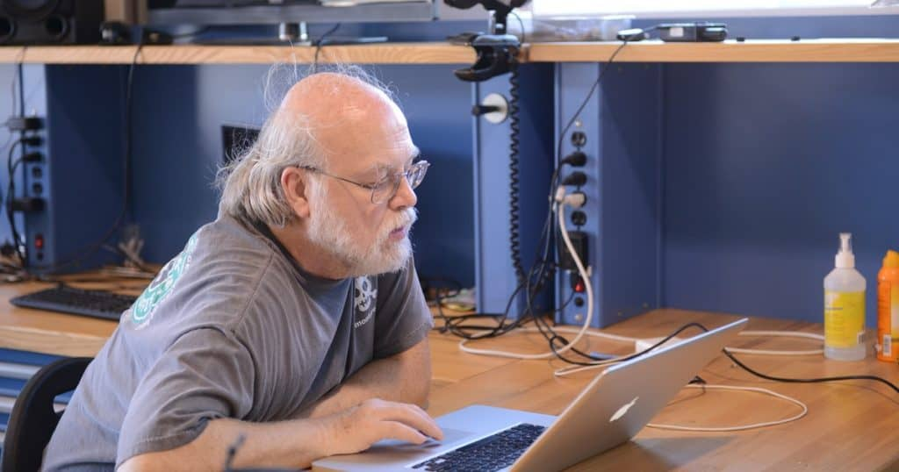

<p> En 1977, Gosling se licenció en ciencias de la computación por la Universidad de Calgary. En 1983, se doctoró por la Universidad Carnegie Mellon, su tesis doctoral se tituló La manipulación algebraica de las limitaciones. Su director de tesis fue Raj Reddy. Mientras trabajaba para su doctorado, escribió una versión de Emacs (Gosling Emacs), y antes de unirse a Sun Microsystems, construyó una versión multi-procesador de Unix, así como varios compiladores y sistemas de correo.</p>

[nighthacks.com](http://nighthacks.com/jag/bio/index.html)<br>

### Incluye

- Plataforma Java, Edición Estándar (Java Platform, Standard Edition), o Java SE (antes J2SE).
- Plataforma Java, Edición Empresa (Java Platform, Enterprise Edition), o Java EE (antes J2EE).
- Plataforma Java, Edición Micro (Java Platform, Micro Edition), o Java ME (antes J2ME).

### Caracteristicas

- Lenguaje java fuertemente tipado
- Lenguaje Orientao a Objeto (POO)
- Esta en todas partes
- Poupular

### Popularidad a Nivel Nacional 2021

  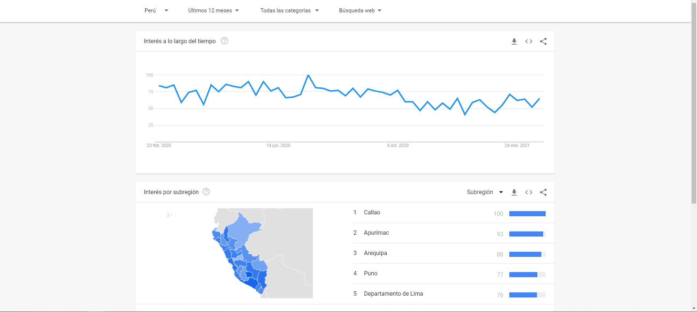

### Ejemplo

  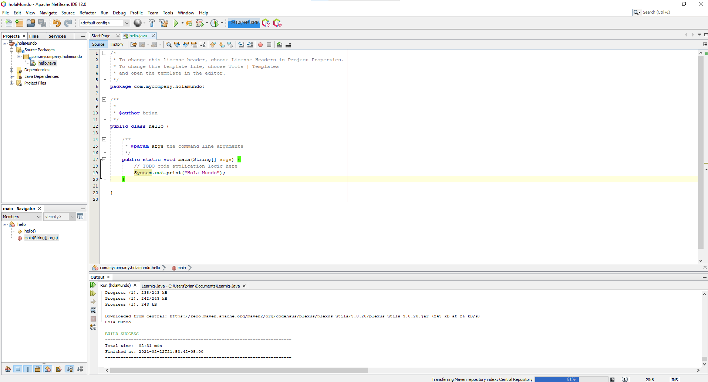

### Las plataformas de lenguaje de programación Java

_Hay cuatro plataformas del lenguaje de programación Java:_

    Plataforma Java, Edición Estándar (Java SE)

    Plataforma Java, Enterprise Edition (Java EE)

    Plataforma Java, Micro Edition (Java ME)

    Javafx

```bash
######################
### Grafico ###
######################

Java SE [1]
|
| Java EE [2]
|   |
|   | Java ME [3]
|   |   |
|   |   | Java FX [4]
|   |   |  |
|   |   |  |  
|   |   |  |   
|   |   |  |_ _ _ _ _ _ _ _ _ _        
|   |   |_ _ _ _ _ _ _ _       |        
|   |_ _ _ _ _          |      |         
|             |         |      |         
Edición  Enterprise   Java    Web
Estándar   Edition    Micro 
                     Edition

```
### Plataformas

* Java SE
Cuando la mayoría de la gente piensa en el lenguaje de programación Java, piensan en la API de Java SE. La API de Java SE proporciona la funcionalidad principal del lenguaje de programación Java. Define todo, desde los tipos y objetos básicos del lenguaje de programación Java hasta las clases de alto nivel que se utilizan para redes, seguridad, acceso a bases de datos, desarrollo de interfaz gráfica de usuario (GUI) y análisis XML.

     Además de la API principal, la plataforma Java SE consta de una máquina virtual, herramientas de desarrollo, tecnologías de        implementación y otras bibliotecas de clases y kits de herramientas comúnmente utilizados en aplicaciones de tecnología Java.
----
* Java EE
La plataforma Java EE se basa en la plataforma Java SE. La plataforma Java EE proporciona una API y un entorno de tiempo de ejecución para desarrollar y ejecutar aplicaciones de red seguras, escalables, fiables y de gran escalado.
----
* Java ME
La plataforma Java ME proporciona una API y una máquina virtual de espacio pequeño para ejecutar aplicaciones de lenguaje de programación Java en dispositivos pequeños, como teléfonos móviles. La API es un subconjunto de la API de Java SE, junto con bibliotecas de clases especiales útiles para el desarrollo de aplicaciones de dispositivos pequeños. Las aplicaciones Java ME son a menudo clientes de servicios de plataforma Java EE.
----
* Javafx
JavaFX es una plataforma para crear aplicaciones de Internet enriquecidas mediante una API ligera de interfaz de usuario. Las aplicaciones JavaFX utilizan motores de medios y gráficos acelerados por hardware para aprovechar los clientes de mayor rendimiento y una apariencia moderna, así como API de alto nivel para conectarse a orígenes de datos en red. Las aplicaciones JavaFX pueden ser clientes de servicios de plataforma Java EE.

---

  
## Instalacion

📦 [Instalador JDK 11](https://www.oracle.com/java/technologies/javase-jdk11-downloads.html) Intalador Oracle JDK Java SE Development ☕ <br>
📦 [Instalador JDK 15](https://www.oracle.com/java/technologies/javase-jdk15-downloads.html) Intalador Oracle JDK Java SE Development ACTUAL ☕ <br>
📦 [Instalador Netbeans 12](https://netbeans.org/) Intalador Apache NetBeans. <br>
📦 [Instalardor Visual Studio Code](https://code.visualstudio.com/) Intalador Visual Studio Code. <br>
📦 [Instalador Eclipse](https://www.eclipse.org/downloads/) Intalador Eclipse Technology. <br>
📦 [Instalador IntelliJ IDEA](https://www.jetbrains.com/es-es/idea/) Intalador IntelliJ IDEA de jetbrains. <br>

 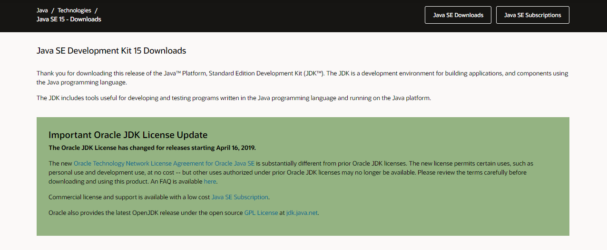

---


## Hola Mundo

  | Carpeta                    | Link |     Home   |  Code | Version | Estado |
|----------------------------|:-----------:|:-----------:|:-----------:|:-----------:|:-----------:|
| [Hola Mundo](https://github.com/BrianMarquez3/Learning-Java/tree/main/holaMundo)          |      ✔️     |  [⬅️Atras](#Tabla-de-contenidos) | yes | yes | ✔️ |

Look at the following code:

```diff

  /*
 * To change this license header, choose License Headers in Project Properties.
 * To change this template file, choose Tools | Templates
 * and open the template in the editor.
 */

  /**
 *
 * @author brian
 */
 
 /**
     * @param args the command line arguments
     */
+     public static void main(String[] args) {
-         // ordenamiento_burbuja
}
 
```
## Concatenacion

```java
public static void main(String args[]) {
        var usuario = "Juan";
        var titulo = "Ingeniero";
        var union = titulo + " " + usuario;
        System.out.println("union = " + union);
        
        var i = 3;
        var j = 4;
        
        System.out.println(i + j);//se realiza la suma de numeros
        System.out.println(i + j + usuario); //Evaluación de izq a der, realiza suma
        System.out.println(usuario + i + j);//contexto cadena, todo es una cadena
        System.out.println(usuario + (i + j));//uso de parentesis modifican la prioridad en la evaluacion
        
    }
```

## Scanner

```java
System.out.println("Escribe tu nombre: ");
Scanner consola = new Scanner(System.in);
var usuario = consola.nextLine();
System.out.println("usuario = " + usuario);
```

---

## Tipos Primitivos

`MIN_VALUE` y `MAX_VALUE`

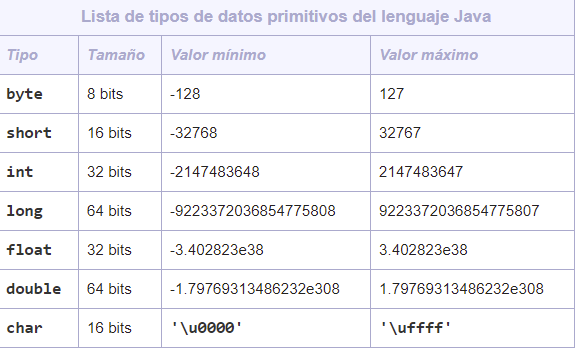

  | Carpeta                    | Link |       Home   |  Code | Version | Estado |
|----------------------------|:-----------:|:-----------:|:-----------:|:-----------:|:-----------:|
| [Datos Primitivos](https://github.com/BrianMarquez3/Learning-Java/tree/main/tiposPrimitivos)          |      ✔️     |  [⬅️Atras](#Tabla-de-contenidos) | yes | yes | ✔️ |

### Tipos Primitivos Enteros

```java
public static void main(String args[]) {
        /*
            tipos primitivos enteros: byte, short, int, long
         */
        byte numeroByte = (byte) 129;
        System.out.println("Valor byte:" + numeroByte);
        System.out.println("Valor minimo byte:" + Byte.MIN_VALUE);
        System.out.println("Valor maximo byte:" + Byte.MAX_VALUE);

        short numeroShort = (short)32768;
        System.out.println("numeroShort = " + numeroShort);
        System.out.println("Valor minimo short:" + Short.MIN_VALUE);
        System.out.println("Valor maximo short:" + Short.MAX_VALUE);
        
        int numeroInt = (int)2147483648L;
        System.out.println("numeroInt = " + numeroInt);
        System.out.println("Valor minimo int:" + Integer.MIN_VALUE);
        System.out.println("Valor maximo int:" + Integer.MAX_VALUE);
        
        long numeroLong = 9223372036854775807L;
        System.out.println("numeroLong = " + numeroLong);
        System.out.println("Valor minimo long:" + Long.MIN_VALUE);
        System.out.println("Valor maximo long:" + Long.MAX_VALUE);
    }
```

### Tipos Primitivos Char

```java
ublic static void main(String args[]) {
        char miCaracter = 'a';
        System.out.println("miCaracter = " + miCaracter);
        
        char varChar = '\u0021';
        System.out.println("varChar = " + varChar);
        
        char varCharDecimal = 33;
        System.out.println("varCharDecimal = " + varCharDecimal);
        
        char varCharSimbolo = '!';
        System.out.println("varCharSimbolo = " + varCharSimbolo);
        
        var varChar1 = '\u0021';
        System.out.println("varChar1 = " + varChar1);
        
        var varCharDecimal2 = 33;
        System.out.println("varCharDecimal2 = " + varCharDecimal2);
        
        var varCharSimbolo3 = '!';
        System.out.println("varCharSimbolo3 = " + varCharSimbolo3);
        
        int variableEnteraSimbolo = '!';
        System.out.println("variableEnteraSimbolo = " + variableEnteraSimbolo);
        
        int letra = 'A';
        System.out.println("letra = " + letra);
        
        
    }

```

### Tipos Primitivos Boolean

```java
public static void main(String args[]) {
        /*
            tipos primitivos de tipo flotante: float y double
        */
        
        float numeroFloat = (float)3.4028235E38D;
        System.out.println("numeroFloat = " + numeroFloat);
        System.out.println("Valor minimo tipo float: " + Float.MIN_VALUE);
        System.out.println("Valor maximo tipo float: " + Float.MAX_VALUE);
        
        double numeroDouble = 1.7976931348623157E308;
        System.out.println("numeroDouble = " + numeroDouble);
        System.out.println("Valor minimo tipo double: " + Double.MIN_VALUE);
        System.out.println("Valor maximo tipo double: " + Double.MAX_VALUE);
    }
```

---

<table align="center" >
  <p align="center">Performance</p>
  <tr>
    <td align="center" style="padding=0;width=50%;">
      
    </td>
  </tr>
</table>

## Variables
   
```java
    byte - 8 bits
    short - 16 bit
    int - 32 bits
    long - 64 bits
    float  -32 bits
    double  -64 bits
    char - 16 bits
    boolean - 1 bits
```

###  Tipos de Datos Primitivos en Java   

1. `byte`

  Representa un tipo de dato de 8 bits con signo. De tal manera que puede almacenar los valores numéricos de -128 a 127.
  
---
2. `short`

  Representa un tipo de dato de 16 bits con signo. De esta manera almacena valores numéricos de -32.768 a 32.767.

---
3. `int` 

  Es un tipo de dato de 32 bits con signo para almacenar valores numéricos. Cuyo valor mínimo es -2^31 y el valor máximo 2^31-1.

4. `float`

  Es un tipo dato para almacenar números en coma flotante con precisión simple de 32 bits.

---
5. `double` 

  Es un tipo de dato para almacenar números en coma flotante con doble precisión de 64 bits.

---
6. `boolean`

  Sirve para definir tipos de datos booleanos. Es decir, aquellos que tienen un valor de true o false. Ocupa 1 bit de información.

---
7. `char` 

  Es un tipo de datos que representa a un carácter Unicode sencillo de 16 bits.


### Valores por defecto de los tipos de datos primitivos

<table>

  <tr>
    <td>Dato Primitivo</td>
    <td>Valor por Defecto</td>
  </tr>

  <tr>
    <td>byte</td>
    <td>0</td>
  </tr>

   <tr>
    <td>short</td>
    <td>0</td>
  </tr>

  <tr>
    <td>int</td>
    <td>0</td>
  </tr>

   <tr>
    <td>long</td>
    <td>0L</td>
  </tr>

   <tr>
    <td>float</td>
    <td>0.0f</td>
  </tr>

  <tr>
    <td>double</td>
    <td>0.0d</td>
  </tr>

  <tr>
    <td>char</td>
    <td>‘u0000’</td>
  </tr>

  <tr>
    <td>String</td>
    <td>null</td>
  </tr>

   <tr>
    <td>boolean</td>
    <td>false</td>
  </tr>
  

  | Carpeta                    | Link |       Home   |  Code | Version | Estado |
|----------------------------|:-----------:|:-----------:|:-----------:|:-----------:|:-----------:|
| [Variables I Datos Primitivos](https://github.com/BrianMarquez3/Learnig-Java/tree/main/variables)          |      ✔️     |  [⬅️Atras](#Tabla-de-contenidos) | yes | yes | ✔️ |

Look at the following code:

```diff

  /*
 * To change this license header, choose License Headers in Project Properties.
 * To change this template file, choose Tools | Templates
 * and open the template in the editor.
 */

  /**
 *
 * @author brian
 */
 
 /**
     * @param args the command line arguments
     */
+     public static void main(String[] args) {
-         // ordenamiento_burbuja
}
 
```

---

## Variables-II

| Carpeta                    | Link        |      Home   |  Code       | Version     | Estado |
|----------------------------|:-----------:|:-----------:|:-----------:|:-----------:|:-----------:|
| [Variables II Datos Envoltorio](https://github.com/BrianMarquez3/Learnig-Java/tree/main/variables_II_Datos_Envoltorio)          |      ✔️     |  [⬅️Atras](#Tabla-de-contenidos) | yes | yes | ✔️ |

Look at the following code:

```diff

  /*
 * To change this license header, choose License Headers in Project Properties.
 * To change this template file, choose Tools | Templates
 * and open the template in the editor.
 */

  /**
 *
 * @author brian
 */
 
 /**
     * @param args the command line arguments
     */
+     public static void main(String[] args) {
-         // ordenamiento_burbuja
}
 
```

---

## Constantes

  | Carpeta                    | Link |      Home   |  Code | Version | Estado |
|----------------------------|:-----------:|:-----------:|:-----------:|:-----------:|:-----------:|
| [Constantes](https://github.com/BrianMarquez3/Learning-Java/tree/main/constantes)          |      ✔️     |  [⬅️Atras](#Tabla-de-contenidos) | yes | yes | ✔️ |

Look at the following code:

```diff

  /*
 * To change this license header, choose License Headers in Project Properties.
 * To change this template file, choose Tools | Templates
 * and open the template in the editor.
 */

  /**
 *
 * @author brian
 */
 
 /**
     * @param args the command line arguments
     */
+     public static void main(String[] args) {
-         // ordenamiento_burbuja
}
 
```

---

## Ingresar Datos Consola

  | Carpeta                    | Link |     Home   |  Code | Version | Estado |
|----------------------------|:-----------:|:-----------:|:-----------:|:-----------:|:-----------:|
| [Ingresar Datos Consola ](https://github.com/BrianMarquez3/Learning-Java/tree/main/IngresarDatosConsola)          |      ✔️     |   [⬅️Atras](#Tabla-de-contenidos) | yes | yes | ✔️ |

Look at the following code:

```diff

  /*
 * To change this license header, choose License Headers in Project Properties.
 * To change this template file, choose Tools | Templates
 * and open the template in the editor.
 */

  /**
 *
 * @author brian
 */
 
 /**
     * @param args the command line arguments
     */
+     public static void main(String[] args) {
-         // ordenamiento_burbuja
}
 
```

---

## Ingresar Dato ViaShow InputDialog

  | Carpeta                    | Link |      Home   |  Code | Version | Estado |
|----------------------------|:-----------:|:-----------:|:-----------:|:-----------:|:-----------:|
| [Ingresar Dato ViaShow InputDialog ](https://github.com/BrianMarquez3/Learning-Java/tree/main/IngresarDatosViaShowInputDialog)          |      ✔️     |  [⬅️Atras](#Tabla-de-contenidos) | yes | yes | ✔️ |

Look at the following code:

```diff

  /*
 * To change this license header, choose License Headers in Project Properties.
 * To change this template file, choose Tools | Templates
 * and open the template in the editor.
 */

  /**
 *
 * @author brian
 */
 
 /**
     * @param args the command line arguments
     */
+     public static void main(String[] args) {
-         // ordenamiento_burbuja
}
 
```

---

## Operadores Matematicos

  | Carpeta                    | Link |       Home   |  Code | Version | Estado |
|----------------------------|:-----------:|:-----------:|:-----------:|:-----------:|:-----------:|
| [Operadores Matematicos ](https://github.com/BrianMarquez3/Learning-Java/tree/main/operadoresMatematicos)          |      ✔️     |  [⬅️Atras](#Tabla-de-contenidos) | yes | yes | ✔️ |

Look at the following code:

```diff

  /*
 * To change this license header, choose License Headers in Project Properties.
 * To change this template file, choose Tools | Templates
 * and open the template in the editor.
 */

  /**
 *
 * @author brian
 */
 
 /**
     * @param args the command line arguments
     */
+     public static void main(String[] args) {
-         // ordenamiento_burbuja
}
 
```

---

## Operadores Matematicos Cortos

  | Carpeta                    | Link |      Home   |  Code | Version | Estado |
|----------------------------|:-----------:|:-----------:|:-----------:|:-----------:|:-----------:|
| [Operadores Matematicos Cortos ](https://github.com/BrianMarquez3/Learning-Java/tree/main/operadoresMatematicosCortos)          |      ✔️     |  [⬅️Atras](#Tabla-de-contenidos) | yes | yes | ✔️ |

Look at the following code:

```diff

  /*
 * To change this license header, choose License Headers in Project Properties.
 * To change this template file, choose Tools | Templates
 * and open the template in the editor.
 */

  /**
 *
 * @author brian
 */
 
 /**
     * @param args the command line arguments
     */
+     public static void main(String[] args) {
-         // ordenamiento_burbuja
}
 
```

---

## Operador Incremental Decremental

  | Carpeta                    | Link |     Home   |  Code | Version | Estado |
|----------------------------|:-----------:|:-----------:|:-----------:|:-----------:|:-----------:|
| [Operador Incremental Decremental ](https://github.com/BrianMarquez3/Learning-Java/tree/main/operadorIncrementalDecremental)          |      ✔️     |  [⬅️Atras](#Tabla-de-contenidos) | yes | yes | ✔️ |

Look at the following code:

```diff

  /*
 * To change this license header, choose License Headers in Project Properties.
 * To change this template file, choose Tools | Templates
 * and open the template in the editor.
 */

  /**
 *
 * @author brian
 */
 
 /**
     * @param args the command line arguments
     */
+     public static void main(String[] args) {
-         // ordenamiento_burbuja
}
 
```

---

## Operaciones Matematicas Math

  | Carpeta                    | Link |      Home   |  Code | Version | Estado |
|----------------------------|:-----------:|:-----------:|:-----------:|:-----------:|:-----------:|
| [Operaciones Matematicas Math ](https://github.com/BrianMarquez3/Learning-Java/tree/main/operacionesMatematicasMath)          |      ✔️     |  [⬅️Atras](#Tabla-de-contenidos) | yes | yes | ✔️ |

Look at the following code:

```diff

  /*
 * To change this license header, choose License Headers in Project Properties.
 * To change this template file, choose Tools | Templates
 * and open the template in the editor.
 */

  /**
 *
 * @author brian
 */
 
 /**
     * @param args the command line arguments
     */
+     public static void main(String[] args) {
-         // ordenamiento_burbuja
}
 
```

---

## Calcular volumen de un cilindro

  | Carpeta                    | Link |      Home   |  Code | Version | Estado |
|----------------------------|:-----------:|:-----------:|:-----------:|:-----------:|:-----------:|
| [Calcular volumen de un cilindro ](https://github.com/BrianMarquez3/Learning-Java/tree/main/calcularvolumendeuncilindro)          |      ✔️     |  [⬅️Atras](#Tabla-de-contenidos) | yes | yes | ✔️ |

Look at the following code:

```diff

  /*
 * To change this license header, choose License Headers in Project Properties.
 * To change this template file, choose Tools | Templates
 * and open the template in the editor.
 */

  /**
 *
 * @author brian
 */
 
 /**
     * @param args the command line arguments
     */
+     public static void main(String[] args) {
-         // ordenamiento_burbuja
}
 
```

---

## Manejo de Fechas

  | Carpeta                    | Link |      Home   |  Code | Version | Estado |
|----------------------------|:-----------:|:-----------:|:-----------:|:-----------:|:-----------:|
| [Manejo de fechas ](https://github.com/BrianMarquez3/Learning-Java/tree/main/fechas)          |      ✔️     |   [⬅️Atras](#Tabla-de-contenidos) | yes | yes | ✔️ |

Look at the following code:

```diff

  /*
 * To change this license header, choose License Headers in Project Properties.
 * To change this template file, choose Tools | Templates
 * and open the template in the editor.
 */

  /**
 *
 * @author brian
 */
 
 /**
     * @param args the command line arguments
     */
+     public static void main(String[] args) {
-         // ordenamiento_burbuja
}
 
```

---

## Condicionales

_Ejemplo de Condiciones_

```java
public static void main(String[] args) {
        // condicionales (Sentencia IF, Else)
        Scanner entra= new Scanner(System.in);
        int numUser, numSis;
        numSis = (int) (Math.random()*10);
        System.out.println("Ingresa este numero "+numSis+": ");
        numUser = entra.nextInt();
        
        if(numUser == numSis){
            System.out.println("Coinciden ");
        }else{
            System.out.println("no coinciden ");
        }
    }
```

  | Carpeta                    | Link |     Home   |  Code | Version | Estado |
|----------------------------|:-----------:|:-----------:|:-----------:|:-----------:|:-----------:|
| [Condicionales](https://github.com/BrianMarquez3/Learning-Java/tree/main/condicionales)          |      ✔️     |  [⬅️Atras](#Tabla-de-contenidos) | yes | yes | ✔️ |

Look at the following code:

```diff

  /*
 * To change this license header, choose License Headers in Project Properties.
 * To change this template file, choose Tools | Templates
 * and open the template in the editor.
 */

  /**
 *
 * @author brian
 */
 
 /**
     * @param args the command line arguments
     */
+     public static void main(String[] args) {
-         // ordenamiento_burbuja
}
 
```

---

<table align="center" >
  <p align="center">Escalabilidad</p>
  <tr>
    <td align="center" style="padding=0;width=50%;">
      
    </td>
  </tr>
</table>


## Condicionales II

```java
Scanner entrada = new Scanner(System.in);
        System.out.println("Sleccione una Opcion: \n1: Acceso\n2: Confguracion\n3: Ayuda");
        int seleccione = entrada.nextInt();
        switch(seleccione){
            case 1: System.out.println("Seleccionaleste el Acceso");
            break;
            
            case 2: System.out.println("Seleccionaleste Configuracion");
            break;
            
            case 3: System.out.println("Seleccionaleste Ayuda");
            break;
            
            default:
            System.out.println("Opcion no Valida"); 
            break;
        }
```

  | Carpeta                    | Link |     Home   |  Code | Version | Estado |
|----------------------------|:-----------:|:-----------:|:-----------:|:-----------:|:-----------:|
| [Condicionales II](https://github.com/BrianMarquez3/Learning-Java/tree/main/condicionales_II_switch_case)          |      ✔️     |  [⬅️Atras](#Tabla-de-contenidos) | yes | yes | ✔️ |

Look at the following code:

```diff

  /*
 * To change this license header, choose License Headers in Project Properties.
 * To change this template file, choose Tools | Templates
 * and open the template in the editor.
 */

  /**
 *
 * @author brian
 */
 
 /**
     * @param args the command line arguments
     */
+     public static void main(String[] args) {
-         // ordenamiento_burbuja
}
 
```

---

## Condicionales III  

```java
Scanner entrada = new Scanner(System.in);
        System.out.println("Escriba una opcion:\nacceso\nconfguracion\nayuda");
        String seleccione = entrada.nextLine();
        seleccione = seleccione.toLowerCase();
        switch(seleccione){
            case "acceso" :
                   System.out.println("Seleccionaleste el acceso");
            break;
            
            case "confguracion" :
                System.out.println("Seleccionaleste configuracion");
            break;
            
            case "ayuda":
                System.out.println("Seleccionaleste ayuda");
            break;
            
            default:
            System.out.println("Opcion no Valida"); 
            break;
        }
```

* Ejemplo II

```java
public static void main(String args[]) {
        var mes = 4;
        var estacion = "Estacion desconocida";
        
        switch(mes){
            case 1: case 2: case 12:
                estacion = "Invierno";
                break;
            case 3: case 4: case 5:
                estacion = "Primavera";
                break;
            case 6: case 7: case 8:
                estacion = "Verano";
                break;
            case 9: case 10: case 11:
                estacion = "Otonio";
                break;
        }
        ystem.out.println("estacion = " + estacion);
    }
```

  | Carpeta                    | Link |      Home   |  Code | Version | Estado |
|----------------------------|:-----------:|:-----------:|:-----------:|:-----------:|:-----------:|
| [Condicionales III](https://github.com/BrianMarquez3/Learning-Java/tree/main/condicionales_III_String)          |      ✔️     |  [⬅️Atras](#Tabla-de-contenidos) | yes | yes | ✔️ |

Look at the following code:

```diff

  /*
 * To change this license header, choose License Headers in Project Properties.
 * To change this template file, choose Tools | Templates
 * and open the template in the editor.
 */

  /**
 *
 * @author brian
 */
 
 /**
     * @param args the command line arguments
     */
+     public static void main(String[] args) {
-         // ordenamiento_burbuja
}
 
```

---
## Adivinar numero random

  | Carpeta                    | Link |     Home   |  Code | Version | Estado |
|----------------------------|:-----------:|:-----------:|:-----------:|:-----------:|:-----------:|
| [Adivinar numero random](https://github.com/BrianMarquez3/Learning-Java/tree/main/adivinar_numero_random)          |      ✔️     |  [⬅️Atras](#Tabla-de-contenidos) | yes | yes | ✔️ |

Look at the following code:

```diff

  /*
 * To change this license header, choose License Headers in Project Properties.
 * To change this template file, choose Tools | Templates
 * and open the template in the editor.
 */

  /**
 *
 * @author brian
 */
 
 /**
     * @param args the command line arguments
     */
+     public static void main(String[] args) {
-         // ordenamiento_burbuja
}
 
```

---

## Ciclo While

| Carpeta                    | Link |      Home   |  Code | Version | Estado |
|----------------------------|:-----------:|:-----------:|:-----------:|:-----------:|:-----------:|
| [Ciclo While](https://github.com/BrianMarquez3/Learning-Java/tree/main/ciclo_While)          |      ✔️     |  [⬅️Atras](#Tabla-de-contenidos) | yes | yes | ✔️ |

Look at the following code:

```diff

  /*
 * To change this license header, choose License Headers in Project Properties.
 * To change this template file, choose Tools | Templates
 * and open the template in the editor.
 */

  /**
 *
 * @author brian
 */
 
 /**
     * @param args the command line arguments
     */
+     public static void main(String[] args) {
-         // ordenamiento_burbuja
}
 
```
---
## Ciclo Do While

  | Carpeta                    | Link |      Home   |  Code | Version | Estado |
|----------------------------|:-----------:|:-----------:|:-----------:|:-----------:|:-----------:|
| [Ciclo Do While](https://github.com/BrianMarquez3/Learning-Java/tree/main/ciclo_doWhile)          |      ✔️     |  [⬅️Atras](#Tabla-de-contenidos) | yes | yes | ✔️ |

Look at the following code:

```diff

  /*
 * To change this license header, choose License Headers in Project Properties.
 * To change this template file, choose Tools | Templates
 * and open the template in the editor.
 */

  /**
 *
 * @author brian
 */
 
 /**
     * @param args the command line arguments
     */
+     public static void main(String[] args) {
-         // ordenamiento_burbuja
}
 
```
---
## Ciclo For

  | Carpeta                    | Link |      Home   |  Code | Version | Estado |
|----------------------------|:-----------:|:-----------:|:-----------:|:-----------:|:-----------:|
| [Ciclo For](https://github.com/BrianMarquez3/Learning-Java/tree/main/ciclo_For)          |      ✔️     | [⬅️Atras](#Tabla-de-contenidos) | yes | yes | ✔️ |

---

## Ciclo foreach

  | Carpeta                    | Link |   Home   |  Code | Version | Estado | 
|----------------------------|:-----------:|:-----------:|:-----------:|:-----------:|:-----------:|
| [Ciclo foreach](https://github.com/BrianMarquez3/Learning-Java/tree/main/ciclo_foreach)          |      ✔️     | [⬅️Atras](#Tabla-de-contenidos) | yes | yes | ✔️ |

Look at the following code:

```diff

  /*
 * To change this license header, choose License Headers in Project Properties.
 * To change this template file, choose Tools | Templates
 * and open the template in the editor.
 */

  /**
 *
 * @author brian
 */
 
 /**
     * @param args the command line arguments
     */
+     public static void main(String[] args) {
-         // ordenamiento_burbuja
}
 
```

---

## Escalera con For

  | Carpeta                    | Link |       Home   |  Code | Version | Estado |
|----------------------------|:-----------:|:-----------:|:-----------:|:-----------:|:-----------:|
| [Escalera con For](https://github.com/BrianMarquez3/Learning-Java/tree/main/escalera_conFor)    |      ✔️     |  [⬅️Atras](#Tabla-de-contenidos) | yes | yes | ✔️ |

Look at the following code:

```diff

  /*
 * To change this license header, choose License Headers in Project Properties.
 * To change this template file, choose Tools | Templates
 * and open the template in the editor.
 */

  /**
 *
 * @author brian
 */
 
 /**
     * @param args the command line arguments
     */
+     public static void main(String[] args) {
-         // ordenamiento_burbuja
}
 
```
---
## Arreglos

<P> Un array (arreglo) en Java es una estructura de datos que nos permite almacenar un conjunto de datos de un mismo tipo. El tamaño de los arrays se declara en un primer momento y no puede cambiar luego durante la ejecución del programa, como sí puede hacerse en otros lenguajes.</P>

  | Carpeta                    | Link |      Home   |  Code | Version | Estado |
|----------------------------|:-----------:|:-----------:|:-----------:|:-----------:|:-----------:|
| [Arreglos](https://github.com/BrianMarquez3/Learning-Java/tree/main/arreglos)          |      ✔️     | [⬅️Atras](#Tabla-de-contenidos) | yes | yes | ✔️ |

Look at the following code:

```diff

  /*
 * To change this license header, choose License Headers in Project Properties.
 * To change this template file, choose Tools | Templates
 * and open the template in the editor.
 */

  /**
 *
 * @author brian
 */
 
 /**
     * @param args the command line arguments
     */
+     public static void main(String[] args) {
-         // ordenamiento_burbuja
}
 
```

---
## Mezclar 2 Arreglos

```java

 public static void main(String[] args) {
        // mezclar2Arreglos
          int a[]=new int[5];
          int b[]=new int[5];
          int c[]=new int[10];
          
        for(int i=0;i<5;i++){
            a[i]= Integer.parseInt(JOptionPane.showInputDialog("Ingresa el valor "+ (i+1)+" del arreglo a"));
        }
        for(int i=0;i<5;i++){
            b[i]= Integer.parseInt(JOptionPane.showInputDialog("Ingresa el valor "+ (i+1)+" del arreglo b"));
        }
        
        int j=0;
        for(int i=0;i<5;i++){
            c[j]=a[i];
            j++;
            c[j]=b[i];
            j++;
        }
        for(int elemento:c){
            System.out.println(elemento);
    }

```

  | Carpeta                    | Link |       Home   |  Code | Version | Estado |
|----------------------------|:-----------:|:-----------:|:-----------:|:-----------:|:-----------:|
| [Mezclar 2 Arreglos](https://github.com/BrianMarquez3/Learning-Java/tree/main/mezclar2Arreglos)          |      ✔️     | [⬅️Atras](#Tabla-de-contenidos) | yes | yes | ✔️ |

Look at the following code:

```diff

  /*
 * To change this license header, choose License Headers in Project Properties.
 * To change this template file, choose Tools | Templates
 * and open the template in the editor.
 */

  /**
 *
 * @author brian
 */
 
 /**
     * @param args the command line arguments
     */
+     public static void main(String[] args) {
-         // ordenamiento_burbuja
}
 
```


---

## Palindromos

<P>, también llamado palíndromo, palíndroma o palindroma, es una palabra o frase que se lee igual en un sentido que en otro (por ejemplo, Ana) </P>

  | Carpeta                    | Link |       Home   |  Code | Version | Estado |
|----------------------------|:-----------:|:-----------:|:-----------:|:-----------:|:-----------:|
| [Palindromos](https://github.com/BrianMarquez3/Learning-Java/tree/main/palidromos)          |      ✔️     |  [⬅️Atras](#Tabla-de-contenidos) | yes | yes | ✔️ |

Look at the following code:

```diff

  /*
 * To change this license header, choose License Headers in Project Properties.
 * To change this template file, choose Tools | Templates
 * and open the template in the editor.
 */

  /**
 *
 * @author brian
 */
 
 /**
     * @param args the command line arguments
     */
+     public static void main(String[] args) {
-         // ordenamiento_burbuja
}
 
```


---

## Ordenamientos Metodo de la Burbuja

<P>  hace múltiples pasadas a lo largo de una lista. Compara los ítems adyacentes e intercambia los que no están en orden. Cada pasada a lo largo de la lista ubica el siguiente valor más grande en su lugar apropiado. En esencia, cada ítem “burbujea” hasta el lugar al que pertenece.</P>

  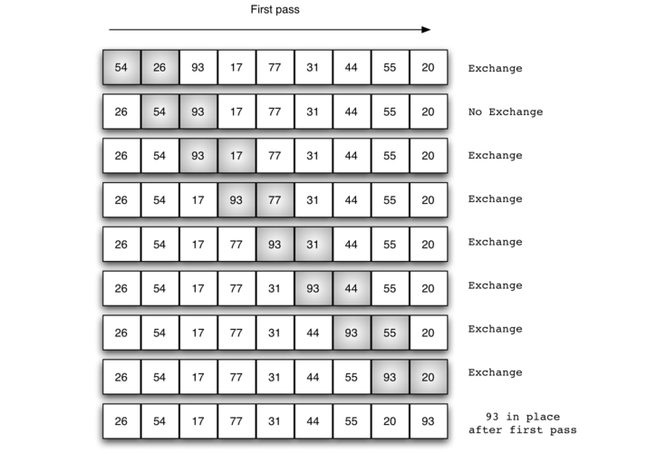

  | Carpeta                    | Link |    Home   |  Code | Version | Estado |  
|----------------------------|:-----------:|:-----------:|:-----------:|:-----------:|:-----------:|
| [Ordenamientos Metodo de la Burbuja](https://github.com/BrianMarquez3/Learning-Java/tree/main/ordenamiento_burbuja)          |      ✔️     | [⬅️Atras](#Tabla-de-contenidos) | yes | yes | ✔️ |

Look at the following code:

```diff

  /*
 * To change this license header, choose License Headers in Project Properties.
 * To change this template file, choose Tools | Templates
 * and open the template in the editor.
 */

  /**
 *
 * @author brian
 */
 
 /**
     * @param args the command line arguments
     */
+     public static void main(String[] args) {
-         // ordenamiento_burbuja
}
 
```

---

## Ordenamientos Metodo de la Burbuja Mejorado

| Carpeta                    | Link |    Home   |  Code | Version | Estado |  
|----------------------------|:-----------:|:-----------:|:-----------:|:-----------:|:-----------:|
| [Ordenamientos Metodo de la Burbuja Mejorado](https://github.com/BrianMarquez3/Learning-Java/tree/main/ordenamientos_burbujaMejorado)          |      ✔️     | [⬅️Atras](#Tabla-de-contenidos) | yes | yes | ✔️ |

Look at the following code:

```diff

  /*
 * To change this license header, choose License Headers in Project Properties.
 * To change this template file, choose Tools | Templates
 * and open the template in the editor.
 */

  /**
 *
 * @author brian
 */
 
 /**
     * @param args the command line arguments
     */
+     public static void main(String[] args) {
-         // ordenamiento_burbuja
}
 
```
---
## Ordenamientos por Seleccion


| Carpeta                    | Link |    Home   |  Code | Version | Estado |  
|----------------------------|:-----------:|:-----------:|:-----------:|:-----------:|:-----------:|
| [Ordenamiento por seleccion](https://github.com/BrianMarquez3/Learning-Java/tree/main/ordenamiento_porSeleccion)          |      ✔️     | [⬅️Atras](#Tabla-de-contenidos) | yes | yes | ✔️ |

Look at the following code:

```diff

  /*
 * To change this license header, choose License Headers in Project Properties.
 * To change this template file, choose Tools | Templates
 * and open the template in the editor.
 */

  /**
 *
 * @author brian
 */
 
 /**
     * @param args the command line arguments
     */
+     public static void main(String[] args) {
-         // ordenamiento_burbuja
}
 
```
---
## Busqueda Secuencial

| Carpeta                    | Link |    Home   |  Code | Version | Estado |  
|----------------------------|:-----------:|:-----------:|:-----------:|:-----------:|:-----------:|
| [Busqueda Secuencial](https://github.com/BrianMarquez3/Learning-Java/tree/main/Busqueda_Secuencial)          |      ✔️     | [⬅️Atras](#Tabla-de-contenidos) | yes | yes | ✔️ |

Look at the following code:

```diff

  /*
 * To change this license header, choose License Headers in Project Properties.
 * To change this template file, choose Tools | Templates
 * and open the template in the editor.
 */

  /**
 *
 * @author brian
 */
 
 /**
     * @param args the command line arguments
     */
+     public static void main(String[] args) {
-         // ordenamiento_burbuja
}
 
```
---

## Busqueda Binaria

| Carpeta                    | Link |    Home   |  Code | Version | Estado |  
|----------------------------|:-----------:|:-----------:|:-----------:|:-----------:|:-----------:|
| [Busqueda Binaria](https://github.com/BrianMarquez3/Learning-Java/tree/main/Busqueda_Binaria)          |      ✔️     | [⬅️Atras](#Tabla-de-contenidos) | yes | yes | ✔️ |

Look at the following code:

```java
 while(inf<=sup){
            centro=(sup+inf)/2;
            if(elementos [centro] == numBuscar){
                bandera = true;
            break;
            }
            else if (numBuscar < elementos[centro]){
                    sup=centro-1;           
            }
             else{
                inf= centro +1;
            }
 
```

  

---
## Operadores Java

### Operadores Unitarios

```java
public static void main(String args[]) {
        var a = 3;
        var b = -a;
        System.out.println("a = " + a);
        System.out.println("b = " + b);
        
        var c = true;
        var d = !c;
        System.out.println("c = " + c);
        System.out.println("d = " + d);
        
        //incremento
        //1.preincremento (simbolo antes de la variable)
        var e = 3;
        var f = ++e;//primero se incrementa la variable y despues se usa su valor
        System.out.println("e = " + e);
        System.out.println("f = " + f);
        //2.postincremento (simbolo despues de la variable)
        var g = 5;
        var h = g++;//primero se utiliza el valor y despues se incrementa
        System.out.println("g = " + g);//teniamos pendiente un incremento
        System.out.println("h = " + h);
        
        //decremento
        //1.predecremento
        var i = 2;
        var j = --i;
        System.out.println("i = " + i);//ya esta drecrementada
        System.out.println("j = " + j);
        
        //2.postdecremento
        var k = 4;
        var l = k--;//primero se usa el valor de la variable y queda pendiente decremento
        System.out.println("k = " + k);//tenia pendiente un drecremento
        System.out.println("l = " + l);
    }
```
### Operadores Ternario

| Carpeta                    | Link |      Home   |  Code | Version | Estado |
|----------------------------|:-----------:|:-----------:|:-----------:|:-----------:|:-----------:|
| [Operador Ternario](https://github.com/BrianMarquez3/Learning-Java/tree/main/OperarioTernario)          |      ✔️     |  [⬅️Atras](#Operadores-Java) | yes | yes | ✔️ |

### Break y Continue

| Carpeta                    | Link |      Home   |  Code | Version | Estado |
|----------------------------|:-----------:|:-----------:|:-----------:|:-----------:|:-----------:|
| [Break y Continue](https://github.com/BrianMarquez3/Learning-Java/tree/main/BreakContinue)          |      ✔️     |  [⬅️Atras](#Operadores-Java) | yes | yes | ✔️ |

---

## Fundamentos Java
### Clases en Java


| Carpeta                    | Link |      Home   |  Code | Version | Estado |
|----------------------------|:-----------:|:-----------:|:-----------:|:-----------:|:-----------:|
| [Clases en Java](https://github.com/BrianMarquez3/Learning-Java/tree/main/OperarioTernario)          |      ✔️     |  [⬅️Atras](#Fundamentos-Java) | yes | yes | ✔️ |


## Creacion de Metodos

| Carpeta                    | Link |      Home   |  Code | Version | Estado |
|----------------------------|:-----------:|:-----------:|:-----------:|:-----------:|:-----------:|
| [Creacion de Metodos](https://github.com/BrianMarquez3/Learning-Java/tree/main/Creacion_Metodos_%20Java)          |      ✔️     |  [⬅️Atras](#Fundamentos-Java) | yes | yes | ✔️ |

## Operador This

- Uso opcional es un apractica comun, , hace referecia a un atributo de la clase
- Al ver this nos dice que hace refereciia un atributo de la clases

```java
this.a = a; // El argumento a sse asigna al atributo this.a
this.b = a;
```

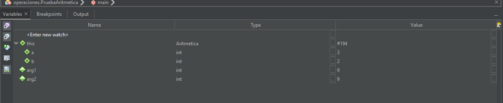

| Carpeta                    | Link |      Home   |  Code | Version | Estado |
|----------------------------|:-----------:|:-----------:|:-----------:|:-----------:|:-----------:|
| [Operador This](https://github.com/BrianMarquez3/Learning-Java/tree/main/metodo_this)          |      ✔️     |  [⬅️Atras](#Fundamentos-Java) | yes | yes | ✔️ |

## Constructores

| Carpeta                    | Link |      Home   |  Code | Version | Estado |
|----------------------------|:-----------:|:-----------:|:-----------:|:-----------:|:-----------:|
| [Constructores](https://github.com/BrianMarquez3/Learning-Java/tree/main/Constructores)          |      ✔️     |  [⬅️Atras](#Fundamentos-Java) | yes | yes | ✔️ |


## Sobrecarga Constructores

| Carpeta                    | Link |      Home   |  Code | Version | Estado |
|----------------------------|:-----------:|:-----------:|:-----------:|:-----------:|:-----------:|
| [Sobrecarga Constructores](https://github.com/BrianMarquez3/Learning-Java/tree/main/Sobrecarga_Constructores)          |      ✔️     |  [⬅️Atras](#Fundamentos-Java) | yes | yes | ✔️ |

## Alcance de Variables

- Existe dos tipos de Almacenamiento en Memerio Stack y Heeap:

    * Stack : Variables Locales
    * Heap: almacenar objetos

- Recolector de Basura de Memoria

```java
system.gc();
```

| Carpeta                    | Link |      Home   |  Code | Version | Estado |
|----------------------------|:-----------:|:-----------:|:-----------:|:-----------:|:-----------:|
| [Alcance de Variables](https://github.com/BrianMarquez3/Learning-Java/tree/main/Alcance_De_Variables)          |      ✔️     |  [⬅️Atras](#Fundamentos-Java) | yes | yes | ✔️ |


## Proyecto caja

| Carpeta                    | Link |      Home   |  Code | Version | Estado |
|----------------------------|:-----------:|:-----------:|:-----------:|:-----------:|:-----------:|
| [Proyecto caja](https://github.com/BrianMarquez3/Learning-Java/tree/main/Proyecto_Caja)          |      ✔️     |  [⬅️Atras](#Fundamentos-Java) | yes | yes | ✔️ |

## Paso por valor

| Carpeta                    | Link |      Home   |  Code | Version | Estado |
|----------------------------|:-----------:|:-----------:|:-----------:|:-----------:|:-----------:|
| [Paso por valor](https://github.com/BrianMarquez3/Learning-Java/tree/main/Paso%20por%20Valor)          |      ✔️     |  [⬅️Atras](#Fundamentos-Java) | yes | yes | ✔️ |
## Paso por referencia

| Carpeta                    | Link |      Home   |  Code | Version | Estado |
|----------------------------|:-----------:|:-----------:|:-----------:|:-----------:|:-----------:|
| [Paso por referencia](https://github.com/BrianMarquez3/Learning-Java/tree/main/Paso%20por%20Referencia)          |      ✔️     |  [⬅️Atras](#Fundamentos-Java) | yes | yes | ✔️ |

## Return Null en Java

| Carpeta                    | Link |      Home   |  Code | Version | Estado |
|----------------------------|:-----------:|:-----------:|:-----------:|:-----------:|:-----------:|
| [Return Null en Java](https://github.com/BrianMarquez3/Learning-Java/tree/main/Return_Null_en_Java)          |      ✔️     |  [⬅️Atras](#Fundamentos-Java) | yes | yes | ✔️ |

## Uso del This

  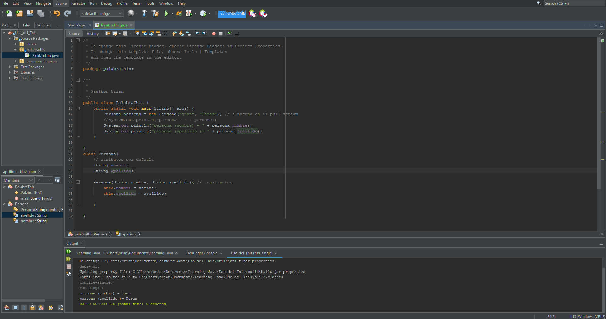

| Carpeta                    | Link |      Home   |  Code | Version | Estado |
|----------------------------|:-----------:|:-----------:|:-----------:|:-----------:|:-----------:|
| [Uso del This](https://github.com/BrianMarquez3/Learning-Java/tree/main/Uso_del_This)          |      ✔️     |  [⬅️Atras](#Fundamentos-Java) | yes | yes | ✔️ |


## Uso del This 2


| Carpeta                    | Link |      Home   |  Code | Version | Estado |
|----------------------------|:-----------:|:-----------:|:-----------:|:-----------:|:-----------:|
| [Uso del This 2](https://github.com/BrianMarquez3/Learning-Java/tree/main/Uso_del_This_2)          |      ✔️     |  [⬅️Atras](#Fundamentos-Java) | yes | yes | ✔️ |


## Encapsulamiento

`getSueldo()`: retorna
`setSueldo()`: Modifica

### Ejemplo Encapsulamiento

```java
public String getNombre(){
        return this.nombre;
    }    
    
    public void setNombre(String nombre){ // set modificar
        this.nombre = nombre;
    }
```

| Carpeta                    | Link |      Home   |  Code | Version | Estado |
|----------------------------|:-----------:|:-----------:|:-----------:|:-----------:|:-----------:|
| [Encapsulamiento](https://github.com/BrianMarquez3/Learning-Java/tree/main/Encapsulamiento)          |      ✔️     |  [⬅️Atras](#Fundamentos-Java) | yes | yes | ✔️ |


## Metodo toString


| Carpeta                    | Link |      Home   |  Code | Version | Estado |
|----------------------------|:-----------:|:-----------:|:-----------:|:-----------:|:-----------:|
| [Metodo toString](https://github.com/BrianMarquez3/Learning-Java/tree/main/Metodo_toString)          |      ✔️     |  [⬅️Atras](#Fundamentos-Java) | yes | yes | ✔️ |


## Contexto estatico

Contexto Estatico y Contexto Dinamico

palabra `static`

| Carpeta                    | Link |      Home   |  Code | Version | Estado |
|----------------------------|:-----------:|:-----------:|:-----------:|:-----------:|:-----------:|
| [Contexto estatico](https://github.com/BrianMarquez3/Learning-Java/tree/main/ContextoStatico)          |      ✔️     |  [⬅️Atras](#Fundamentos-Java) | yes | yes | ✔️ |


## Contexto estatco 2

| Carpeta                    | Link |      Home   |  Code | Version | Estado |
|----------------------------|:-----------:|:-----------:|:-----------:|:-----------:|:-----------:|
| [Contexto estatco 2](https://github.com/BrianMarquez3/Learning-Java/tree/main/ContextoStatico_2)          |      ✔️     |  [⬅️Atras](#Fundamentos-Java) | yes | yes | ✔️ |

## Herencia

  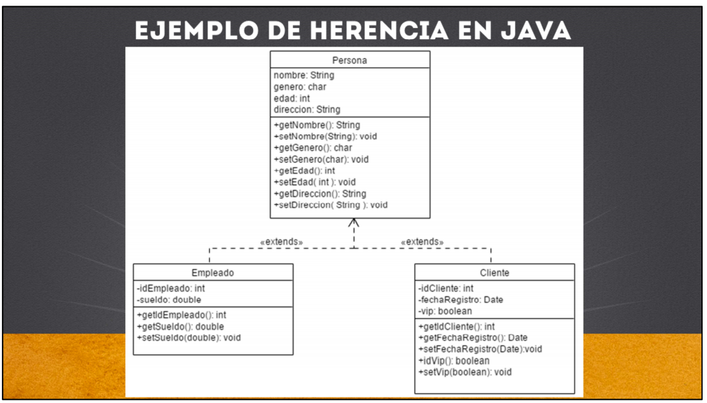

```
super();
```

<p> La palabra clave super en Java es una variable de referencia que se usa para referir objetos de clase padre.</p>


## Sobrecarga de Contructores

| Files                   | Link |      Home   |  Code | Version | Estado |
|----------------------------|:-----------:|:-----------:|:-----------:|:-----------:|:-----------:|
| [Sobrecarga de Contructores](https://github.com/BrianMarquez3/Learning-Java/tree/main/SobrecargaConstructores_Ejercicio)          |      ✔️     |  [⬅️Atras](#Fundamentos-Java) | yes | yes | ✔️ |

## Sobrecarga de Metodos

| Files                   | Link |      Home   |  Code | Version | Estado |
|----------------------------|:-----------:|:-----------:|:-----------:|:-----------:|:-----------:|
| [Sobrecarga de Metodos](https://github.com/BrianMarquez3/Learning-Java/tree/main/SobrecarcaMetodos)          |      ✔️     |  [⬅️Atras](#Fundamentos-Java) | yes | yes | ✔️ |

## Paquetes

| Files                   | Link |      Home   |  Code | Version | Estado |
|----------------------------|:-----------:|:-----------:|:-----------:|:-----------:|:-----------:|
| [Paquete](https://github.com/BrianMarquez3/Learning-Java/tree/main/Paquetes)          |      ✔️     |  [⬅️Atras](#Fundamentos-Java) | yes | yes | ✔️ |


## Palabra Final


_Uso de la Palabra Final_

- En variables: Evita cambiar el valor que almacena la variable

- En Metodos: Evitar que se modifique la definicion de un metodos desde una subclases

- En Clases: Evita que se cree una subclase

```java

/*Ejemplo de constante, no se podra modificar*/
public final static int MI_CONSTATNE = 1;

```

<table align="center" >
  <tr>
    <td align="center" style="padding=0;width=50%;">
      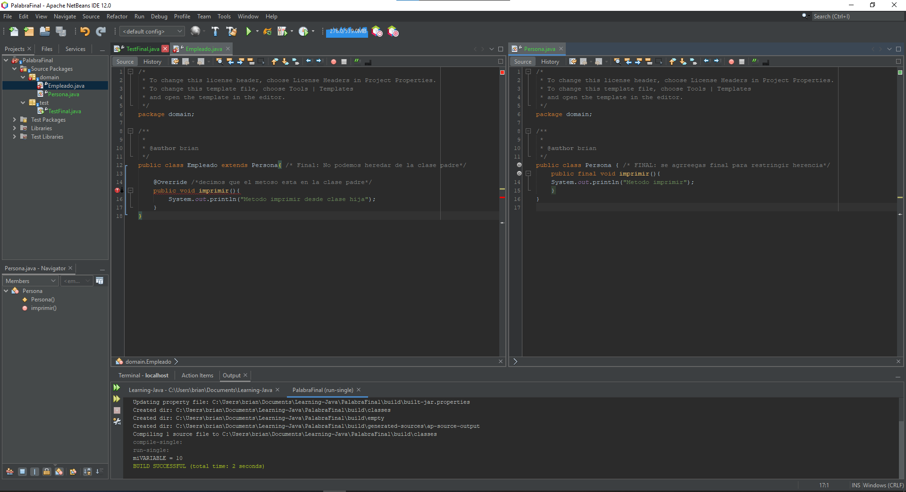
    </td>
  </tr>
</table>


| Files                   | Link |      Home   |  Code | Version | Estado |
|----------------------------|:-----------:|:-----------:|:-----------:|:-----------:|:-----------:|
| [Palabra Final](https://github.com/BrianMarquez3/Learning-Java/tree/main/PalabraFinal)          |      ✔️     |  [⬅️Atras](#Fundamentos-Java) | yes | yes | ✔️ |


## Arreglo III

```java
 public static void main(String[] args) {
        int edades[] = new int [3];
        System.out.println("edades = " + edades);
        
        edades[0] = 10;
        System.out.println("edades o  = " + edades[0] );
        
        for (int i = 0; i<edades.length; i++){
            System.out.println("edades elemento" + i + ":" + edades[i]);
        }
        
//        Sintaxis resumida
        String frutas[] = {"Naranja", "Platano", "Manzana"};
        for (int i = 0; i < frutas.length; i++) {
            System.out.println("Frutas = " + frutas[i]);
        }
```   

| Files                   | Link |      Home   |  Code | Version | Estado |
|----------------------------|:-----------:|:-----------:|:-----------:|:-----------:|:-----------:|
| [Arreglo III](https://github.com/BrianMarquez3/Learning-Java/tree/main/Arreglos_III)          |      ✔️     |  [⬅️Atras](#Fundamentos-Java) | yes | yes | ✔️ |


## Matrices

| Files                   | Link |      Home   |  Code | Version | Estado |
|----------------------------|:-----------:|:-----------:|:-----------:|:-----------:|:-----------:|
| [Matrices I](https://github.com/BrianMarquez3/Learning-Java/tree/main/Matrices)          |      ✔️     |  [⬅️Atras](#Fundamentos-Java) | yes | yes | ✔️ |
| [Matrices II](https://github.com/BrianMarquez3/Learning-Java/tree/main/Matrices_II)          |      ✔️     |  [⬅️Atras](#Fundamentos-Java) | yes | yes | ✔️ |
| [Matrices III](https://github.com/BrianMarquez3/Learning-Java/tree/main/Matrices_III)          |      ✔️     |  [⬅️Atras](#Fundamentos-Java) | yes | yes | ✔️ |
| [Matrices IV](https://github.com/BrianMarquez3/Learning-Java/tree/main/Matrices_IV)          |      ✔️     |  [⬅️Atras](#Fundamentos-Java) | yes | yes | ✔️ |


## UML

[https://www.umletino.com/] -  Online Browser <br>
[https://www.umlet.com/] - Plugin Downloads <br>

<table align="center" >
  <tr>
    <td align="center" style="padding=0;width=50%;">
      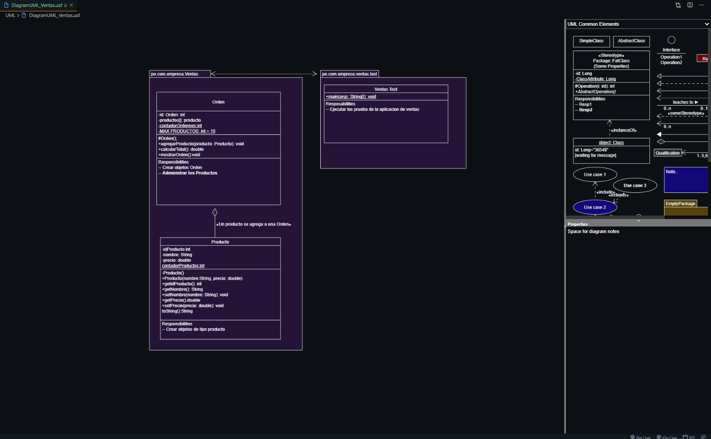
    </td>
  </tr>
</table>


| Files                   | Link |      Home   |  Code | Version | Estado |
|----------------------------|:-----------:|:-----------:|:-----------:|:-----------:|:-----------:|
| [UML](https://github.com/BrianMarquez3/Learning-Java/tree/main/UML)          |      ✔️     |  [⬅️Atras](#Fundamentos-Java) | yes | yes | ✔️ |

---
## Spring Boot

  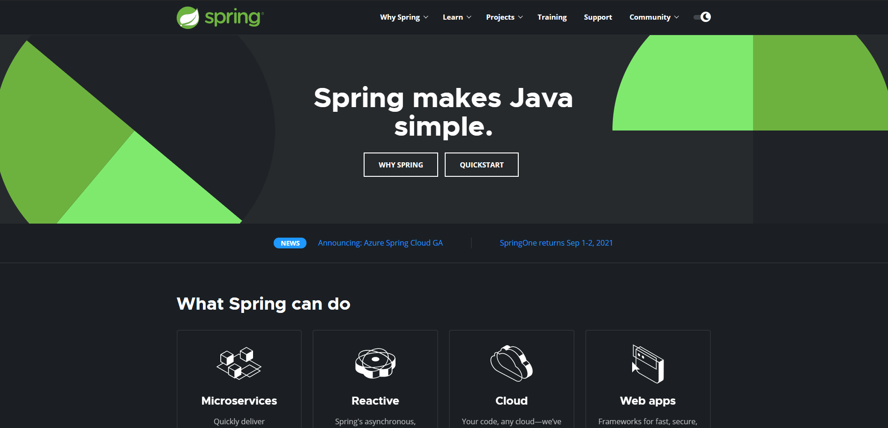

  <p> Spring Boot es una de las tecnologías dentro del mundo de Spring de las que más se esta hablando últimamente.¿Qué es y como funciona Spring Boot? . Para entender el concepto primero debemos reflexionar sobre como construimos aplicaciones con Spring Framework . </p>

  - Spring Boot
  - Spring Framework
  - Spring Cloud Data
  - Spring Cloud (Microservicios)
  - Spring Data (DB)
  - Spring Itegration
  - Spring Security
  - Spring Hateoas
  - Spring REST DOCS
  - Spring Mobile

  

### Spring installation
📦 [Spring Tools](https://spring.io/tools) Intalador de Spring Tools 🍃 <br>

## Indice TIOBE

<p>El índice de la comunidad de programación TIOBE es un indicador de la popularidad de los lenguajes de programación. 
El índice se actualiza una vez al mes. Las calificaciones se basan en la cantidad de ingenieros calificados en todo el mundo, 
cursos y proveedores externos. Los motores de búsqueda populares como Google, Bing, Yahoo !, Wikipedia, Amazon, YouTube y 
Baidu se utilizan para calcular las calificaciones. 
Es importante tener en cuenta que el índice TIOBE no se trata del mejor lenguaje de 
programación o del lenguaje en el que se han escrito la mayoría de las líneas de código .</p>

[Indice TIOBE](https://www.tiobe.com/tiobe-index/)

## Book

<table>
  <tr>
      <td>Name</td>
      <td>Authors</td>
      <td>Editorial</td>
      <td>ISBN</td>
      <td>Link</td>
      <td>Password</td>
  </tr>

  <tr>
      <td>Java Como Programar en Java</td>
      <td>Paul Deitel, Harvey Deitel</td>
      <td>Pearson</td>
      <td>978-607-32-3802-1</td>
      <td><a href="https://dubox.com/s/1cFkU8oFfhACjl1taLzXk6Q">Java Como Programar en Java</a></td>
      <td>k229</td>
  </tr>

</table>


## Spotify Java
🎵 Music Java [List on Spotify 🎤](https://open.spotify.com/playlist/1UMfu4axebdOMeM996K0xP?si=A-pW9orFSRegxZBWoMZp4w)

## Paypal Donation
🩸 Hacer una donación [PAYPAL](https://www.paypal.com/donate?hosted_button_id=98U3T62494H9Y) 🍵

## License 
Todo acerca de la licencia [here](https://github.com/BrianMarquez3/Learning-Java/blob/main/LICENCE)

 <table align="center">
    <tr>
      <td colspan="3">A</td>
        <td>B</td>
      </tr>
      <tr>
        <td>C</td>
      <td colspan="2"></td>
        <td>E</td>
      </tr>
      <tr>
      <td colspan="3">F</td>
        <td>G</td>
    </tr>
</table>

