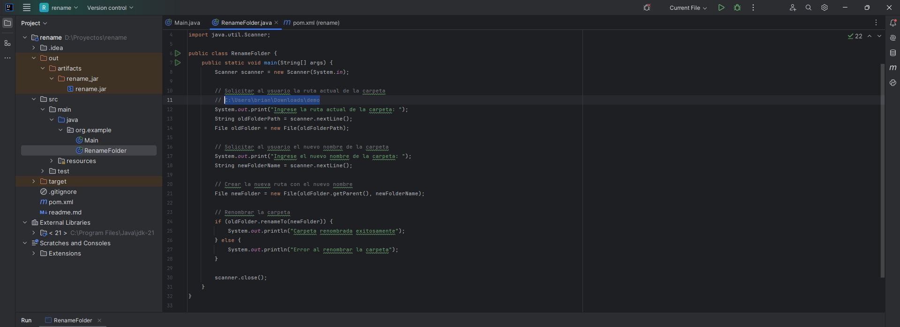

## RENAME

<table align="center" >
  <tr>
    <td align="center" style="padding=0;width=50%;">
      
    </td>
  </tr>
</table>

[Manual para crear instalador](https://www.youtube.com/watch?v=d1CT7_WZGB8)

## Ejecutar

```bash
java -jar rename.jar
```

